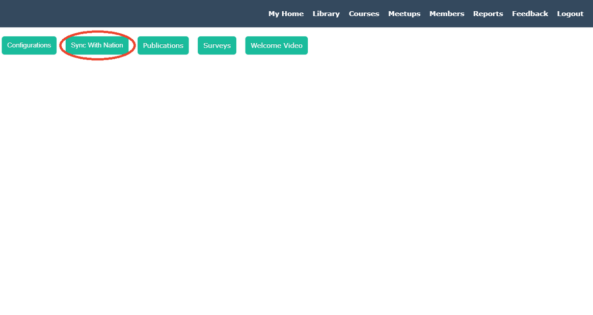

##Nation BeLLs

On the community side of the BeLL, there must be a process of syncing your local community BeLL on your OS. Emily will be completing that process for you currently, but it is important for you to understand it conceptually. First, I signed in as an administrator (admin/password). Then, I clicked on the "Manager" button next to my name that allows me to access administrative material. Once there, I have the option of selecting "Communities" and then manually adding community configurations using the correct and matching information from all of your communities. I have done this step for you with the screenshots you sent in the Gitter chat.

There should be constant communication between the nation and the communities. While is not necessary for remote communities in the field, it is ideal for our goals of improving the software and testing the increasing forms of communication and feedback between the nation and the communities. This communication takes the form of a syncing process from the community side where you select material to send to the nation. In this tutorial, we will be focusing on the community side almost exclusively as we will be introducing the nation side later on.

First, after we register your community but before you can sync with the nation, you need to create an additional dummy user on your community. In terms of the survey functionality that is discussed later, your community does not exist until it has more users than just admin/password. Therefore, create a quick additional user under "Become a Member" on the login page (NOTE: When creating the dummy user, don't give it a password that you actually use, as other people logged in as the admin may be able to see it). Then, login and double-check that you're listed under Members. Then, log out and log back in as admin/password. Now that your community has a user, you can sync with the nation.

It's important to point out that you need to tell us via chat that you need us to send you the survey after you sync with nation. Otherwise, no survey will appear. You should also tell us which user (whether admin or your other user) should take the survey. As you can see from the picture below, click on "Manager".

Next, click on "Sync with Nation".

Then, "Select All" and click "Send".

You have now sent all activities on your community to the nation. To explain further, the nation receives a number of data points: number of resources opened, number of logins, number of members, resource ratings, technical feedback, and resource requests. We don't get specific information on individual users, but rather usage and feedback as whole.

> On the nation side ([vi.ole.org](http://vi.ole.org)), you can log in as admin/password and check that the sync worked. Click on "Manager" once again.

Then, click on "Communities" to access reports from various communities on the nation.

Then, you should see a list of communities and the option to generate a report if you so wished.

This is the usual sync process from the community side. There are three other important kinds of updates that you receive on the community side: updates, publications, and surveys.  

As you can see from the image below, there is an update, a publication, and a survey ready for download.

First, click the "Update Available" button and it will reload your homepage with a successful update message. An update refers to a new software update which improves the software. Next, click on "Publications" and sync the publication.

Last, request that an admin (such as Dogi) send a survey to your nation. Then, click on the "Surveys" button and click the "Download" button to download the survey. After this, your community will have new software, resources, and a survey to take. You can only add these as an administrator: a normal learner would not be able to do this. Once you complete the survey, click the "Submit" button and then repeat the process of sending an activities sync to the nation.
