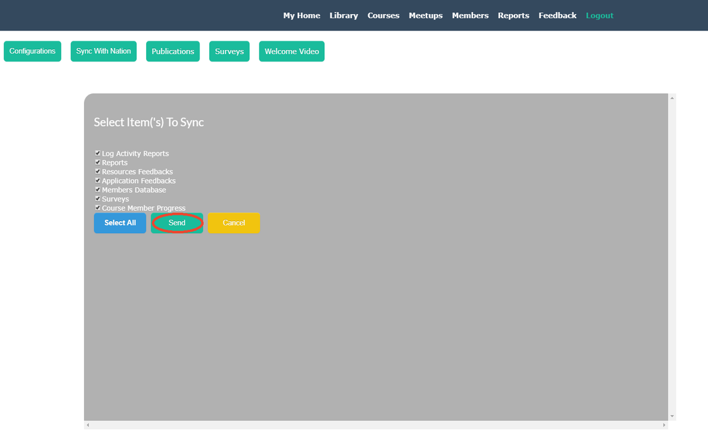
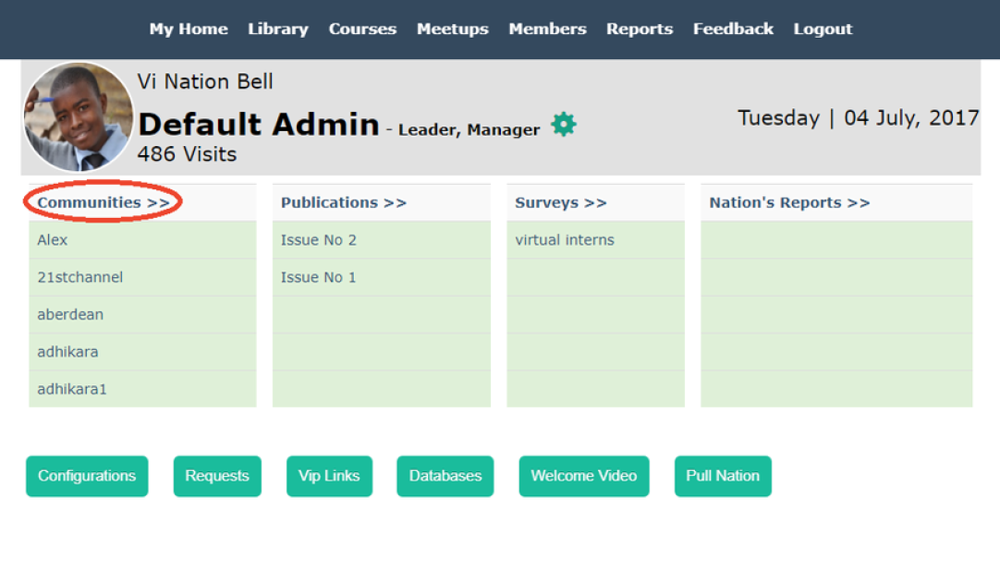

# Nation BeLL
## Objectives
* Learn to sync your Community with the Nation
* Use the Nation interface to check whether your Community successfully joined the Nation
* Update your Community BeLL to the latest version

## Introduction

In step 4, you registered your community BeLL with the nation. Now, you will learn how to keep your community BeLL in sync with the nation.

There should be constant communication between the nation and the communities. While it is not necessary for remote communities in the field, it is ideal for our goals of "improving the software and testing the increasing forms of communication and feedback between the nation and the communities". This communication takes the form of a syncing process from the community side, where you select material to send to the nation.

Click [here](http://127.0.0.1:5985/apps/_design/bell/MyApp/index.html) to access your Community BeLL.

**NOTE**: After you register your community, but before you can sync with the nation, you need to create an additional dummy user on your community. Therefore, create a quick additional user under "Become a Member" on the login page (HINT: When creating the dummy user, don't give it a password that you actually use, as other people logged in as admin may be able to see it-- you won't need the password in the future so don't worry about having to remember or save it after this one time). Then, login and double-check that you're listed under Members. Then, log out and log back in with your admin account. Now that your community has a user, you can sync with the nation.

## Sync With the Nation

In Step 4, you did 3 kinds of updates that you receive on the community side: updates, publications, and surveys. Another important type of update is the reverse: syncing with the nation. This sends data about your community to the nation.

As you can see from the picture below, click on "Manager".

Next, click on "Sync with Nation".

Then, "Select All" and click "Send".

You have now sent all activities on your community to the nation. To explain further, the nation receives a number of data points: number of resources opened, number of logins, number of members, resource ratings, technical feedback, and resource requests. We don't get specific information on individual users, but rather usage and feedback as whole.

## Check the Sync Worked
On the nation side ([vi.ole.org](http://vi.ole.org)), you can log in with the username `admin` and the password `password` and check that the sync worked. Click on "Manager" once again.

Then, click on "Communities" to access reports from various communities on the nation.

Then, you should see a list of communities and the option to generate a report if you so wished.

## Useful Links

[Helpful links and videos](faq.md#Helpful_Links)

#### Return to [First Steps](firststeps.md#Step_7_-_Nation_BeLL)
