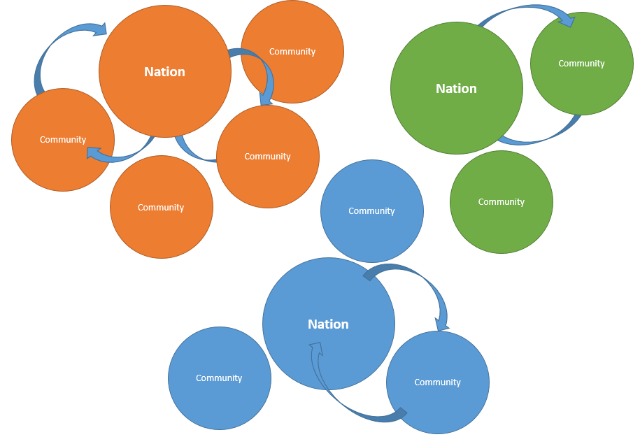

# Open Learning Exchange

# OLE

The [**Open Learning Exchange (OLE)**](http://ole.org) is committed to ensuring that everyone, especially children, has access to a high quality basic education. We work with nation-based entrepreneurs, educators, and practitioners committed to promoting highly effective and affordable learning systems that can benefit all of their people.  We believe this will lead to more productive lives, communities, and nations, and to the possibility of a peaceful world. 

OLE’s mission is to ensure learning for all, not only universal basic literacy and numeracy, but also vital knowledge and skills acquisition in the areas of health, nutrition, community development. Since 2007, OLE International has helped establish Open Learning Communities for children, adolescents, and young adults, including those whose lives have been disrupted by violent conflicts.  Today there are OLE affiliates in in Asia, Africa, the Middle East, and Latin America.

## The PLANET Learning System
### What is the OLE PLANET Learning System (PLANET)?
Personalized Learning And Networked Enabled Teams (PLANET) is a, multi-lingual learning system and library with thousands of educational Resources including books, videos, and educational games.  The system also includes software tools for content and student management, student evaluation and monitoring, and Courses creation.
At the core of PLANET is a repository of free, open access, and public domain Resources designed to benefit literate and preliterate, young and old, and novice and expert learners of all ages.  Resources of all kinds (literature, health, science, math, etc.), in various languages (English, Somali, Swahili, Arabic, Spanish, etc.), and in various formats (text, audio, video) are continually being added to PLANET.
The PLANET system exists in the cloud but it can also be configured to run locally without the need for internet connectivity making it a viable solution for remote locations where internet connectivity is unreliable or nonexistent.  PLANET facilitates frequent assessments of learners, leaders, and administrators.  It also promotes the evaluation and effectiveness of the learning Resources.  Robust usage feedback metrics make PLANET a powerful tool for those overseeing monitoring and evaluation of the education system.

### What are PLANET Nations and Communities?
Under the PLANET system, there are two types of structures: **Nations** and **Communities**.

