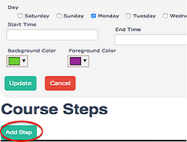

# Open Learning Exchange

# OLE

The [**Open Learning Exchange (OLE)**](http://ole.org) is committed to ensuring that everyone, especially children, has access to a high quality basic education. We work with nation-based entrepreneurs, educators, and practitioners committed to promoting highly effective and affordable learning systems that can benefit all of their people.  We believe this will lead to more productive lives, communities, and nations, and to the possibility of a peaceful world. 

OLE’s mission is to ensure learning for all, not only universal basic literacy and numeracy, but also vital knowledge and skills acquisition in the areas of health, nutrition, community development. Since 2007, OLE International has helped establish Open Learning Communities for children, adolescents, and young adults, including those whose lives have been disrupted by violent conflicts.  Today there are OLE affiliates in in Asia, Africa, the Middle East, and Latin America.

## The PLANET Learning System
### What is the OLE PLANET Learning System (PLANET)?
Personalized Learning And Networked Enabled Teams (PLANET) is a multi-lingual learning system and library with thousands of educational Resources including books, videos, and educational games.  The system also includes software tools for content and student management, student evaluation and monitoring, and Courses creation.
At the core of PLANET is a repository of free, open access, and public domain Resources designed to benefit literate and preliterate, young and old, and novice and expert learners of all ages.  Resources of all kinds (literature, health, science, math, etc.), in various languages (English, Somali, Swahili, Arabic, Spanish, etc.), and in various formats (text, audio, video) are continually being added to PLANET.
The PLANET system exists in the cloud but it can also be configured to run locally without the need for internet connectivity making it a viable solution for remote locations where internet connectivity is unreliable or nonexistent.  PLANET facilitates frequent assessments of learners, leaders, and administrators.  It also promotes the evaluation and effectiveness of the learning Resources.  Robust usage feedback metrics make PLANET a powerful tool for those overseeing monitoring and evaluation of the education system.

### What are PLANET Nations and Communities?
Under the PLANET system, there are two types of structures: **Nations** and **Communities**.

* **Nations**
  * **Nations** always exist in the cloud and require an internet connection to access;
  * Each **Nation** serves as a central repository for the **Community** or **a** group of communities that it serves; and
  * Different **Nations** cannot connect to each other.

* **Communities**
  * A **Community** is a local installations of the PLANET system;
  * A **Community** does not require an internet to access;
  * Users connect to a **Community** via a router through a locally configured _intranet_ using either a device with a web browser (tablet, computer, etc.);
  * Each **Community** connects periodically to a **Nation** via _internet_ in order to receive new materials and to upload user metics; and
  * A **Community** is not able to connect to other **Communities**.

The **nations** may store thousands of Resources in many formats and languages.  Unique collections of Resources can be selected and downloaded into each **Community** from the **Nation**.  This gives a Learner a personalized approach to his or her education.

## How do I navigate and use PLANET?
### _How do I access PLANET and become a member?_

1. To create an account use a web browser to navigate to your Nation or Community and click on “_Become a Member_” to get started.

2. Fill out the resulting form and completing the form, click “_Register_.” You are now a member!

NOTE: Each PLANET system is unique; universal memberships do not exist.  If you become a member of a specific Nation or Community, you do not automatically become a member of any other existing Nations and Community.  To become a member of another Nation or Community you must register with a new account.

###_What are the differences between Learners, Leaders, and Managers?_
In the PLANET system, there are three different kinds of users: **Learners**, **Leaders**, and **Managers**.

**Learner** is the default user level when a person first joins. Each person continues to be a Learner regardless of additional responsibilities and roles. All Learners have access to standard and individualized user functionality.

**Leaders** are Learners that have created a Course or have become _Course Leaders_. Leaders have access to all Learner functionalities and to additional Course management functionalities.

**Managers** have access to Learner, Leader, and additional functionalities that allow them to manage local Resources, publications, collections, surveys, data sync schedules, and local software updates.  
If you are currently using this manual, then you are most likely a manager who is organizing and overseeing a Community or a Nation and its Communities.  In order to see the available manager functionalities, click on “_Manager_” next to your name on the Dashboard (see below, _How do I navigate the Dashboard_). Managers can also add, hide, delete, and view the details of Resources as well they can create, edit, re-categorize, and delete collections. 

###How do I navigate the Dashboard?

An example of the Manager Dashboard is shown below. The functionalities are defined for each element of the Dashboard.

1.**My Home** directs the Learner to the main Dashboard page and provides easy access to most PLANET functionalities.

2.**e-Readers** functionality is under construction.

3.**Library** allows a Learner to browse the digital Resources.  It also allows a Learner to view collections of Resources by topic or to view the Resources alphabetically. 

4.**Courses** gives Learners the option to view each Course and to request admission.

5.**Meetups** allows setup for basic meetings.  Meetups are sent to the calendars of other PLANET Learners.

6.**Members** provides a list of all Learners in this PLANET system. 

7.**Reports** allows Nation Managers to distribute Nation Reports as needed.

8.**Feedback** allows Learners to give feedback for the Resource or page they are viewing.

9.**Logout** logs the Learner out of the PLANET system.

10.**Type of Member** shows the access level of user - Learner, Leader, or Manager. This also allows Managers to oversee Nation maintenance.

11.**Language** shows the language of the user interface and allows the user to switch between languages.

12.**My Library** displays the Resources that were added to “_My Library_” by the Learner.

13.**My Courses** Progress displays Courses in which the Leader/Learner is enrolled and the progress of each Course.

14.**My Meetups** displays the physical location of the Course (if applicable).

15.**My Tutors** is under construction.

16.**Badges** is under construction.

17.**Calendar** can be used to organize and display Meetups and Events for the Learner.

18.**Email** is a basic email system which allows Learners to receive and set notifications and send and receive messages.

19.**Surveys** allows Nation Managers to push a survey PLANET users based on characteristics like age, gender, member type, Community, etc.

20.**Update Welcome Video** allows Managers to change the welcome video for their Nation.

## Courses Overview
### What is a Course?
A Course allows Leaders to walk Learners through specific Resources and exercises to learn new skills.  Leaders can create Courses by grouping and ordering Resources and allowing Learners to upload papers or take Quizzes.  

### How do I create a Course?
To create a Course, log in and start from the Home page.
* Go to the *“Courses”* tab in the top menu and then select *“Add Course.”*

 

* Fill out the following form: 

1. **Course Title.**  The name or title of the Course.

2.	**Language of Instruction.**  The language of Course materials. Please use the name of the language in that language. For example, العربية .

3.	**Member Limit.**  The number of Learners that are allowed to enter the Course.

4.	**Course Leader.**  Choose a single Leader or multiple Leaders to manage the Course

5.	**Description.**  Provide a coure description.

6.	**Method.**  Describe the way you envision the Course being used (e.g., school Course, enrichment Course, training manual, independent learning, special programs, etc.)

7.	**Grade Level.**  Suggested grade level of the Learners

8.	**Subject Level.**  Subject level - beginner, intermediate, or advanced. 

9.	**Start Date.**  Start date of the Course (only if applicable)

10.	**End Date.**  End date of the Course (only if applicable)

11.	**Frequency.**  Frequency of Course meeting, either Daily or Weekly (only if applicable)

12.	**Start Time.**  Start time of the Course (only if applicable)

13.	**End Time.**  End time of the Course (only if applicable)

14.	**Location.**  Physical location of Course (only if applicable)

15.	**Foreground/Background Color.**  Colors shown to Learners on their Dashboard when they join the Course 

  * Scroll down to the bottom of the screen and select *“Add Step”* to create the first lesson of the Course.
  
 

1.	**Title:**  Name of the Step

2.	**Step Method.**  Describe the way you envision the Step being used

3.	**Description.**  Describe the Step and the material that will be covered

4.	**Step Goals.**  List the goals of accomplishing and completing the Step

5.	**Outcomes.**  Please select either Paper, Quiz, or both Paper and Quiz (by selecting both) to complete the Step

6.	**Passing Percentage.**  Select the percentage required on the Paper or Quiz to pass the Step

  * By selecting *“View Details”* of a specific Course, you can then see the screen below and modify the Course. Select *“Add Resource”* to search through the Library for Resources to include in the Step. You can also create a Quiz from this section by selecting *“Create Quiz."*
  

  * In order to add a Resource, click the *“Add Resource”* button. The Resources must exist within PLANET before they can be included in a Course.  
  
  * Follow the instructions below to add Resources to your Course.
  
1.	Perform a keyword search to search for specific Resources.  To refine/broaden your search, filter by subject, Collections, level, medium, or rating.

2.	Check individual or all Resources that come up in the search results.

3.	Click *“Add to Level”* to add the Resource to the Step. 

  **NOTE:** If you go to the next page without adding each Resource, your selections will be erased, so you should add the currently selected Resources before moving on to the next page.
  
4.	In the Step Management panel, click *“View”* to make sure that your Resource is opening properly. To delete a Resource from the Step, click *“Remove.”*.

  * To create a Quiz, click *“View Details.”* Click *“Create Quiz”* button located on the bottom right corner.
  

1.	You can create as many or as few questions as you want for each Quiz.  However, you must give 5 choices (Options A, B, C, D, and E) for each question. You can make True or False questions by making Option A = True, Option B = False, and inserting a “-” to fill the other answer choices. Select *“Add Question”* in order to add the question to your Quiz. **NOTE:** If you do not select *“Add Question,”* the Quiz question will not be automatically added. 

2.	Once your Quiz is complete, click *“Save Quiz.”*

3.	Make sure that the *“Quiz”* box is always checked in the original New Step panel, otherwise the Quiz may not show up. 

4.	You can always return to the Quiz to add questions. NOTE: Once you select *“Next Question,”* you cannot go back or save the Quiz until you have filled it out.

### General Guidelines for Steps and Courses
Below is a list of general guidelines for Steps and Courses.

* Aim to have between 6-10 Steps for each Course, although this will vary depending on the nature of the Course, i.e., if it is for school, general knowledge, professional development, etc. There are examples of Courses of 40-50 Steps which is applicable and needed in those cases. However, Courses should have a minimum of at least five Steps.

* The number of Resources per Course can also vary. However, they should be comprehensive enough to provide thorough knowledge on the subject, offer a variety of “real-world” examples and/or case studies, include some possible activities or thought-provoking discussion questions, and make a smooth transition to the next Step. Try to include a mix of media as well, i.e. videos, audio, photographs.

* As an alternative to creating a Quiz, you can also assign a paper for Learners to upload. Just type the paper assignment in the instruction box for Learners to view.

* If you change your mind and want to create a Quiz instead of a paper or vice versa, you can switch by going to the *“Edit Step”* tab.

### Managing a Course
Below are tips for managing a Course.

* You can always make changes to the Course by going to the “Courses” tab and clicking on “Manage.” 

* To see what your Learners see, click on *“View Course.”* You can also go to *“My Home”* and access the Course in the *“My Courses”* bar to view the Course as a Learner.

* You can invite a specific Learner to join the Course or a whole grade level by clicking on *“Invite Members.”*

* If a Learner has requested to join a Course you will receive an email in your inbox (located at the bottom menu on the *“My Home”* page) asking you to accept. 

* To track your Learners’ completion and score on Quizzes, go to *“Progress.”*

## Members Menu
### _What is Members Menu_
**Members** menu is a place to see, search, modify, and delete (for admin) an entire member of a community/nation where we logged in.

A user is able to see and search for members within the community/nation, but can't modify other members data.
An administrator of a community/nation is able to modify or delete members data if neccessary.
Below is an illustration of the Members menu.

Notes:

1. **Add New Member** - we can add a new member by clicking this button.
2. **List of Members** - we can see list of members here.
3. **Search Members** - insert a member's name here and click _search_ to search for the member.
4. **Open Members Detail** - everyone can see the details of a member here.
5. **Edit Members Detail** - this is an admin only functionality for editing a members account information.
6. **Delete a Member** - this is an admin only functionality for deleting members.

