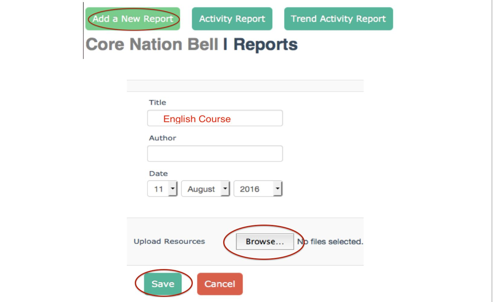

# Open Learning Exchange

# OLE

The [**Open Learning Exchange (OLE)**](http://ole.org) is committed to ensuring that everyone, especially children, has access to a high quality basic education. We work with nation-based entrepreneurs, educators, and practitioners committed to promoting highly effective and affordable learning systems that can benefit all of their people.  We believe this will lead to more productive lives, communities, and nations, and to the possibility of a peaceful world. 

OLE’s mission is to ensure learning for all, not only universal basic literacy and numeracy, but also vital knowledge and skills acquisition in the areas of health, nutrition, community development. Since 2007, OLE International has helped establish Open Learning Communities for children, adolescents, and young adults, including those whose lives have been disrupted by violent conflicts.  Today there are OLE affiliates in in Asia, Africa, the Middle East, and Latin America.

## The PLANET Learning System
### What is the OLE PLANET Learning System (PLANET)?
Personalized Learning And Networked Enabled Teams (PLANET) is a multi-lingual learning system and library with thousands of educational Resources including books, videos, and educational games.  The system also includes software tools for content and student management, student evaluation and monitoring, and Courses creation.
At the core of PLANET is a repository of free, open access, and public domain Resources designed to benefit literate and preliterate, young and old, and novice and expert learners of all ages.  Resources of all kinds (literature, health, science, math, etc.), in various languages (English, Somali, Swahili, Arabic, Spanish, etc.), and in various formats (text, audio, video) are continually being added to PLANET.
The PLANET system exists in the cloud but it can also be configured to run locally without the need for internet connectivity making it a viable solution for remote locations where internet connectivity is unreliable or nonexistent.  PLANET facilitates frequent assessments of learners, leaders, and administrators.  It also promotes the evaluation and effectiveness of the learning Resources.  Robust usage feedback metrics make PLANET a powerful tool for those overseeing monitoring and evaluation of the education system.

### What are PLANET Nations and Communities?
Under the PLANET system, there are two types of structures: **Nations** and **Communities**.

* **Nations**
  * **Nations** always exist in the cloud and require an internet connection to access;
  * Each **Nation** serves as a central repository for the **Community** or **a** group of communities that it serves; and
  * Different **Nations** cannot connect to each other.

* **Communities**
  * A **Community** is a local installations of the PLANET system;
  * A **Community** does not require an internet to access;
  * Users connect to a **Community** via a router through a locally configured _intranet_ using either a device with a web browser (tablet, computer, etc.);
  * Each **Community** connects periodically to a **Nation** via _internet_ in order to receive new materials and to upload user metics; and
  * A **Community** is not able to connect to other **Communities**.

The **nations** may store thousands of Resources in many formats and languages.  Unique collections of Resources can be selected and downloaded into each **Community** from the **Nation**.  This gives a Learner a personalized approach to his or her education.

## How do I navigate and use PLANET?
### _How do I access PLANET and become a member?_

1. To create an account use a web browser to navigate to your Nation or Community and click on “_Become a Member_” to get started.

2. Fill out the resulting form and completing the form, click “_Register_.” You are now a member!

NOTE: Each PLANET system is unique; universal memberships do not exist.  If you become a member of a specific Nation or Community, you do not automatically become a member of any other existing Nations and Community.  To become a member of another Nation or Community you must register with a new account.

### _What are the differences between Learners, Leaders, and Managers?_
In the PLANET system, there are three different kinds of users: **Learners**, **Leaders**, and **Managers**.

**Learner** is the default user level when a person first joins. Each person continues to be a Learner regardless of additional responsibilities and roles. All Learners have access to standard and individualized user functionality.

**Leaders** are Learners that have created a Course or have become _Course Leaders_. Leaders have access to all Learner functionalities and to additional Course management functionalities.

**Managers** have access to Learner, Leader, and additional functionalities that allow them to manage local Resources, publications, collections, surveys, data sync schedules, and local software updates.  
If you are currently using this manual, then you are most likely a manager who is organizing and overseeing a Community or a Nation and its Communities.  In order to see the available manager functionalities, click on “_Manager_” next to your name on the Dashboard (see below, _How do I navigate the Dashboard_). Managers can also add, hide, delete, and view the details of Resources as well they can create, edit, re-categorize, and delete collections. 

### How do I navigate the Dashboard?

An example of the Manager Dashboard is shown below. The functionalities are defined for each element of the Dashboard.

1. **My Home** directs the Learner to the main Dashboard page and provides easy access to most PLANET functionalities.

2. **e-Readers** functionality is under construction.

3. **Library** allows a Learner to browse the digital Resources.  It also allows a Learner to view collections of Resources by topic or to view the Resources alphabetically. 

4. **Courses** gives Learners the option to view each Course and to request admission.

5. **Meetups** allows setup for basic meetings.  Meetups are sent to the calendars of other PLANET Learners.

6. **Members** provides a list of all Learners in this PLANET system. 

7. **Reports** allows Nation Managers to distribute Nation Reports as needed.

8. **Feedback** allows Learners to give feedback for the Resource or page they are viewing.

9. **Logout** logs the Learner out of the PLANET system.

10. **Type of Member** shows the access level of user - Learner, Leader, or Manager. This also allows Managers to oversee Nation maintenance.

11. **Language** shows the language of the user interface and allows the user to switch between languages.

12. **My Library** displays the Resources that were added to “_My Library_” by the Learner.

13. **My Courses** Progress displays Courses in which the Leader/Learner is enrolled and the progress of each Course.

14. **My Meetups** displays the physical location of the Course (if applicable).

15. **My Tutors** is under construction.

16. **Badges** is under construction.

17. **Calendar** can be used to organize and display Meetups and Events for the Learner.

18. **Email** is a basic email system which allows Learners to receive and set notifications and send and receive messages.

19. **Surveys** allows Nation Managers to push a survey PLANET users based on characteristics like age, gender, member type, Community, etc.

20. **Update Welcome Video** allows Managers to change the welcome video for their Nation.

# Library and Resources Overview

## What is the Library?

The library where learning Resources are stored and categorized within the PLANET system.  Resources are listed alphabetized which allows Learners to select the first letter of their Resource or the page number they wish to view.  Additionally, library Resources can be organized into collections which allow Learners to categorize and group Resources by subject or other attributes.  Both Resources and collections are explained in further depth below.

## What is a Resource?

A PLANET Resource is material that has been uploaded into the digital library.  There are many types of Resources, not just books.  PLANET can accommodate PDFs (books), MP3s (audio), MP4s (videos), HTML5 applications  (interactive content), and just about any other format.  Resources can be viewed in the library and may vary from Nations to Communities.  Resources may also stored in a variety of languages, including (but not limited to) English, Kiswahili, French, Spanish, Arabic, and Somali.

## What is a Collection?

A collection is a group of Resources based on topic/subject and intended use.  PLANET currently follows a the Library of Congress categorization system.  Collections exist as the main category.  Sub-collections allow Nation Managers to group Resources more specifically within a collection.  Collections are alphabetized by topic.

# How do I navigate and use the Library?

## How do I upload a Resource?

1.  Log in as a **Learner**, **Leader**, or **Manager**.

2.  Start on the main **_Dashboard_** and click on the **_Library_** heading.

3.  After clicking on the Library heading, choose **_“Add New Resource.”_** You should be taken to the following empty screen:

1.  The **Title** of the Resource goes here. Capitalize all principal words and make sure everything is spelled correctly.  If there are any dashes in the title, leave a space on either side (i.e., “Addition - Subtraction” NOT “Addition-Subtraction”).  Do not start the title with numbers or special characters (!@#$%^&*).  If the title is already taken (for example, a version in another language has already been uploaded) include the language of the new Resource in parentheses. Examples are shown below.

          a. A Tale of Two Cities
          b. A Tale of Two Cities (Spanish)
          
2. Type the name of Author(s)/Editor. Authors should be listed as follows:  “FIRST NAME, LAST NAME.” Illustrators, editors, translators, etc., should be identified in this section with their title in parentheses.

          a. John Doe
          b. Jane Doe (Translator)
          
3. **_Publisher/Attribution_** is mandatory for copyright purposes.  Please do not leave this field blank.  Type the name of the organization or publisher (and any websites associated with the Resource, if applicable).  Attribution allows OLE to use the source under Creative Commons or copyright and protects us violating copyright laws. 

4. If available, type the **_Year_** in which the Resource was published. 

5. **_Link to License_** is also mandatory for copyright purposes.  Locate the copyright information for the Resource. If it has a Creative Commons license, locate the correct license from the Creative Commons website and paste the URL in the Link to License field.  Type “Public Domain” if the Resource is in the public domain.

6. In the **_Language field_**, choose the language of the Resource. If the Resource is a multilingual document, choose the language that you think is the primary or most applicable language.

7. Choose one **_Subject_** from the drop down list that your Resource fits into. Subjects are broad and general so you may not find an exact match. 

8. Select at least one **_Level_** from the drop down list to assign to your Resource. Levels refer to the reading level required to be able to understand this Resource. You may choose multiple levels, but please ensure they actually apply to the reading level of the Resource. 

9. You may choose a **_Collection_** in which to place your Resource. Collections are more narrow than subjects in their scope.  In many cases, you may find a Collection name that already exists and best fits your Resource. Use the search bar at the top of the drop down list to search for relevant Collections. If the Resource fits into more than one Collection, choose more than one. The “Add New” button next to Collection should be used only if a relevant existing Collection cannot be found. In most cases, Learners will not need to add new Collections. 

10. Choose the **_Media_** for your Resource: Text, Graphic/Pictures, Audio/Music/Book, or Video. If you are unsure, leave this tab on the default Text.

11. The **_Open_** field relates to the medium of the Resource. Select the corresponding medium in this field. 
          
          a. A Resource with a .PDF extension has PDF format.
          b. A .mp3 is Audio (MP3) format.
          c. A .mp4 or .flv is Video (MP4, FLV) format. NOTE: If the video does not play when MP4 is selected then try changing this field to FLV and playing the video.
          
12. In the **_Resource For_** field choose Learner or Leader. If appropriate for both, choose Learner.

13. Choose **_Resource Type_** to select which kind of Resource you are uploading: Textbook, Lesson Plan, Activities, Exercises, or Discussion Questions. If your Resource does not seem to fit any of these categories, leave this tab on the default Textbook setting. 

14. With **_Open URL_**, you have the option of using a URL to open the Resource if applicable. For most Resources, this can be left blank. 

15. Use **_Upload Resources_** and the **_Browse_** button to locate your Resource and upload it. Select the **_Browse_** button and locate your file. When you have found it, select Open. Double check all the fields to ensure they are correct and then select Save. 

You will be taken to a loading screen while your Resource is uploaded into the Library. When the upload is complete, you will receive a confirmation for a successful upload.

**IMPORTANT:** Once you have finished uploading your Resource, **locate the Resource in the Library and confirm that it was uploaded correctly and can be viewed/heard.**

We have various types of Resources that either form a Collection or belong to common groups of Resources. These include the African Storybooks, Comic Books, CK-12 Textbooks, TED-Ed videos, Khan Academy Videos, etc.  If you are uploading one of these Resources, please read the specific guides we have created and follow the instructions. This maintains uniformity in Resource details and makes searches easier for Learners.

You may need to use a format converter to put your Resource in the correct format before uploading. There are numerous free online converters which you may use. 

**IMPORTANT:** Until all Nations can communicate with each other and Resources can easily be shared between Nations, Resources that are appropriate for uploading to more than one Nation (i.e. Somaliabell, and Kenyabell) must be uploaded into each Nation using the same cataloging information each time. This can be a time consuming process, but it is currently the only way we can ensure that Resources are available in each Nation.

## How do I name a file so that it can be upoaded?

The following file naming conventions should be used for any new file to upload to PLANET:

* Rename the file with a meaningful and unique file name that can be easily associated with the title/content of the Resource. For example: Alcott_LittleWomen.pdf
* Use alpha-numeric characters only. Do not use special characters (except for "-" and "_").
* Do not include spaces in the file name. Instead of a space, use an underscore.
* Do not use characters or letters that do not exist in the English language. For example, avoid naming your files in Arabic without transliteration.
* If there is a series of Resources, the first part of the file name should be consistent (e.g., module title), followed by the number in the series, followed by the title of the specific file (e.g., ComputerBasics01_GettingToKnowComputers.pdf, ComputerBasics02_UnderstandingOperationSystems.pdf, etc.).
* Use leading zeros (i.e., 01, 02, etc. or 001, 002, etc.) for documents that are part of a series so that they are sorted numerically.

## Are there Resources that have specific rules for uploading?

Yes. These Resources are covered in an additional manual titled, XXXXX. Please read that manual to address specific questions on uploading in other languages, in additional formats, or in existing Collections with special permission. 

## How do I create and use Collections?

Collections can be used by Nation Managers to categorize materials by topic for their Learners. Collections are helpful tools for Learners who wish to easily find and sort Resources in the Library.  **NOTE:** Collections cannot be transferred between Nations and Communities so any changes to a Collection are unique to that specific instance of PLANET.  Collections can only be created or changed by Managers. 

1. Log in to the Manager account. 
2. Click “Library” on the top navigation bar and then “Collections”. 

3. You can either manage existing Collections or create a new Collection. We will first create a new Collection. Click on “Add Collection.”

4. You will then be prompted to fill in the form shown below. Type the Collection name and description. “Nested Under” refers to whether this will be a top level Collection or a sub-Collection.  Sub-Collections are nested under other Collections. If you wish to create a Collection rather than a sub-Collection, please leave this category set to the “--Select--” option.

5. When the form is complete, click “Save” to create the new Collection.

6. To edit a Collection, go back to the main Collection page and click on the button next to the Collection you want to edit. 

7. You will be directed to the same screen as the creation page. Change any of the information which should be updated and click “Save.” You can also delete or nest (sub-categorize) the Collection.

## Members Menu
### _What is Members Menu?_
**Members** menu is a place to see, search, modify, and delete (for admin) an entire member of a community/nation where we logged in.

A user is able to see and search for members within the community/nation, but can't modify other members data.
An administrator of a community/nation is able to modify or delete members data if neccessary.
Below is an illustration of the Members menu.

Notes:

1. **Add New Member** - we can add a new member by clicking this button.
2. **List of Members** - we can see list of members here.
3. **Search Members** - insert a member's name here and click _search_ to search for the member.
4. **Open Members Detail** - everyone can see the details of a member here.
5. **Edit Members Detail** - this is an admin only functionality for editing a members account information.
6. **Delete a Member** - this is an admin only functionality for deleting members.

# Reports Overview

### _What is a Report?_
Reports allows distribution of Nation Reports as needed by Nation Managers. Managers can add new Reports, check the activity on each Report, and look at trends for each Report.

### _How do I create a Report?_
Click on _“Reports”_ on the Dashboard main menu as shown below.

PLANET has three different kinds of Reports:  
      
   **A.** Add a New Report   
   **B.** Activity Report  
   **C.** Trend Activity Report 

#### **Option A:**  
Click on *“Add a New Report”* to add a new Report. Fill in the information for the new Report and add any relevant Resources. Then click *“Save.”*

#### **Option B:**  
In the Reports page, the Manager can also select *“Activity Report.”*

*“Activity Report”* allows the Manager to check any changes that happen between two specific dates. First, select the start and end dates. Then click *“Generate Report.”*

After Clicking on *“Generate Report”* the Manager will be able to view Registered Members, the Activity Report, visits by gender, most frequently opened Resources, highest rated Resource, and lowest rated Resource.

#### **Option C:**
In the Reports page, click *“Trend Activity Report.”*

Then click *“Generate Report.”*

In resulting Report the Manager will be able to see a visual graphic representing activity over the past 12 months as shown below.

## Feedback Overview
### _What is Feedback?_

Feedback allows Learners to provide feedback on the currently open page. Feedback helps OLE make improvements to the software over time.

### _How do I provide Feedback?_

Learners can give feedback for any page or Resource at any time by click on “Feedback” and filling out the information in the form shown below.  When finished, click “Submit” to send feedback to OLE.

## Language Overview
### _How do I change the Language?_

Learners can change the language of the PLANET system at any time by going to the Home page and selecting the language pull down menu  from in the top right corner.

