# Raspberry Pi Zero/W USB gadget

## Getting Started

Plug in the Raspberry Pi to your computer's USB port (preferably USB 3 port), it should take few minutes until the system recognizes it.

NOTE: If it doesn’t recognize it after ~5 minutes, reconnect it.

## Ubuntu 17.10

- Open `Settings`

  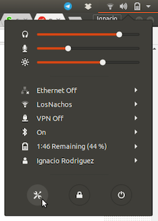

- Go to `Network` settings, to change the settings of the `USB Ethernet` device, click 

  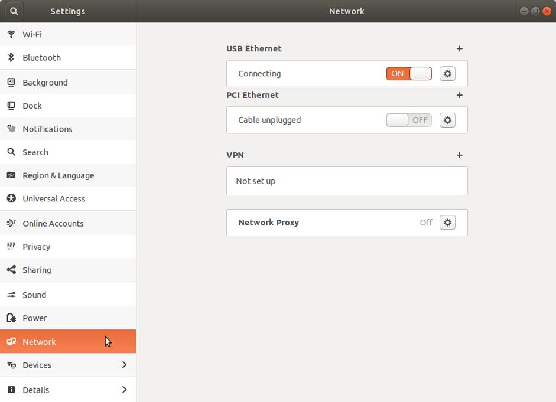

- click `IPv4` on the settings window and change the IPv4 Method to `Lin-Local Only`

  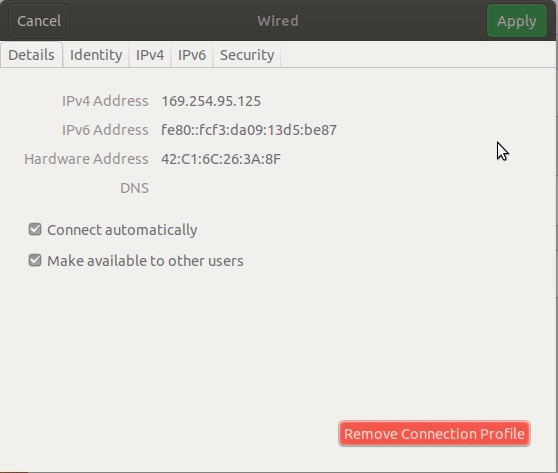

- switch `USB Ethernet` connection to `OFF`, then switch it back `ON`, to restart the connection

  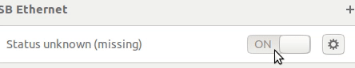

- once the state of the `USB Ethernet` devices changes to `Connected`, you should be able to SSH into it in the terminal **`ssh pi@raspberrypi.local`**

  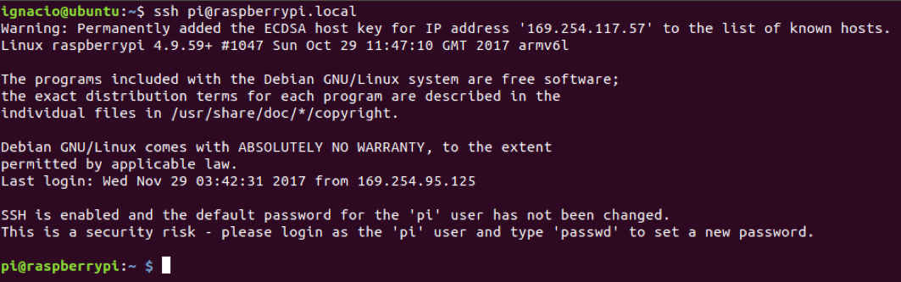

- to get the IP address of the Raspberry Pi, run **`ifconfig usb0`** in the ssh session

  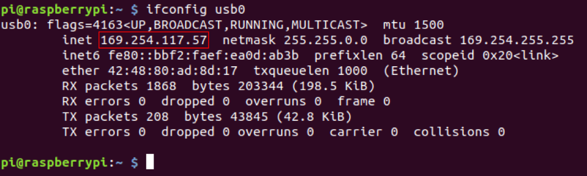

- if you are not able to ssh into the Raspberry Pi using **`ssh pi@raspberrypi.local`**, you may need to find the IP of it using `arp-scan` which can be installed by running **`sudo apt install arp-scan`**
  
  - you will need to find the local interface name, use **`ifconfig`** to get it

    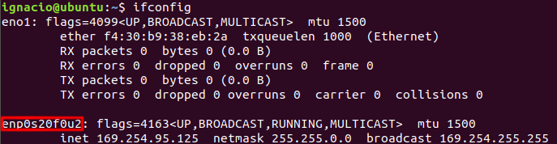

  - run **`sudo arp-scan --localnet --interface=enp0s20f0u2`**, this may take few minutes. When an IP address show up, you can press `Ctrl+C`, in this case the IP address is *169.254.117.57*

    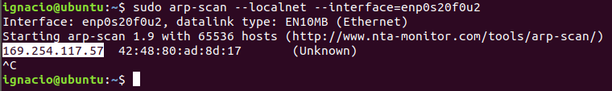

  - use ssh to connect to the Raspberry Pi **`ssh pi@169.254.117.57`**

    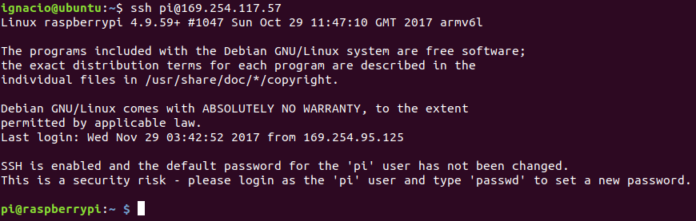

## Windows

- Look for `USB Ethernet/RNDIS Gadget` in `Device Manager` > `Network adapters` to confirm the device is detected

  

- To connect to Raspberry Pi without knowing its IP address, we’ll need Bonjour

  - If you already have Skype, Apple’s iTunes and Adobe Photoshop CS3 or later installed, skip to next section.
  - If you are using package manager Chocolatey (recommended), run choco install bonjour
  - Otherwise check out the instruction at <https://learn.adafruit.com/bonjour-zeroconf-networking-for-windows-and-linux/#microsoft-windows>

- Now, try to SSH into the Raspberry Pi, in Git Bash, run **`ssh pi@raspberrypi.local`**

  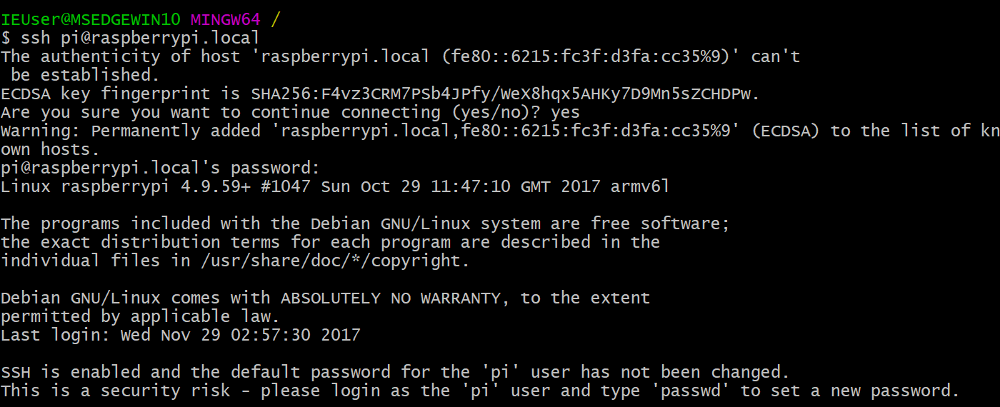

  - If it’s not working, wait a few more minutes or **`ping raspberrypi.local`** until you get something back

    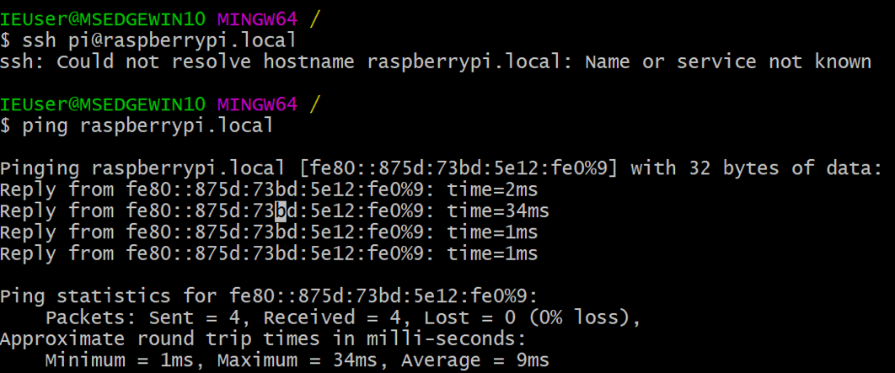

- After successfully SSH into the Raspberry Pi, to get its IP address, run **`ifconfig usb0`** in the ssh session

  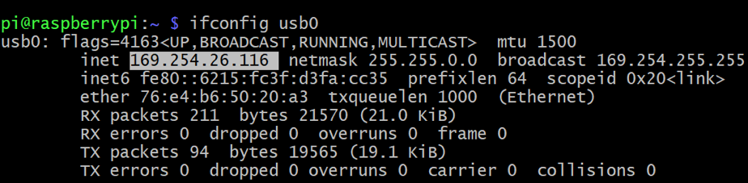

## macOS

- Open  Network  setting using one of the following methods:

  - click on menu bar’s Wi-FI icon > `Open Network Preferences...`

    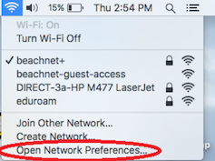

  - click on menu bar’s apple icon > `System Preferences...` > `Network`

  - search for `network.app` in Spotlight

- Wait for `RNDIS/Ethernet Gadget`’s Status change from `Cable Unplugged` to `Connected` (see screenshot)

  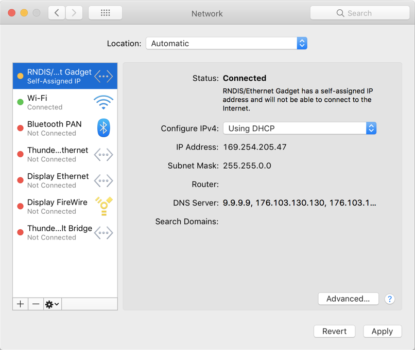

- you should now be able to SSH into the Raspberry Pi using the terminal **`ssh pi@raspberrypi.local`**

  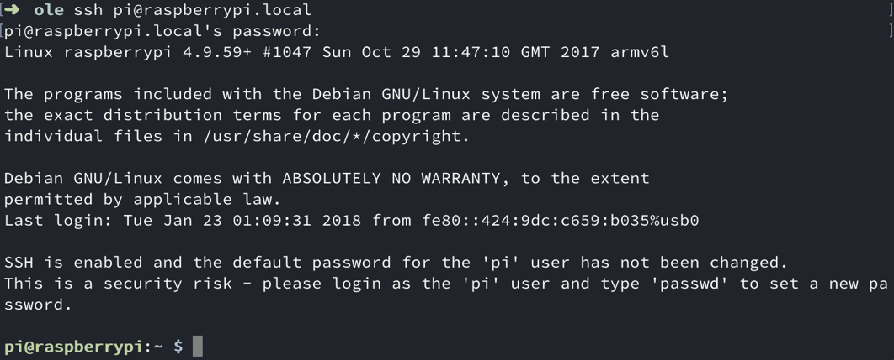

- to get the IP address of the Raspberry Pi, run **`ifconfig usb0`** in the ssh session

  

- if you are not able to ssh into the Raspberry Pi using **`ssh pi@raspberrypi.local`**, you may need to find the IP address of it using `arp-scan` which can be installed by running **`brew install arp-scan`** (assuming you have Homebrew installed already)

  - you will need to find the local interface name, use **`ifconfig`** to get it

    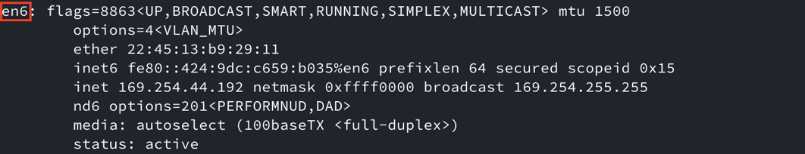

  - run **`arp-scan --localnet --interface=en6`**, this may take few minutes. When an IP address show up, you can press `Ctrl+C`, in this case the IP address is `169.254.191.59`

    

  - use ssh to connect to the Raspberry Pi **`ssh pi@ 169.254.191.59`**

    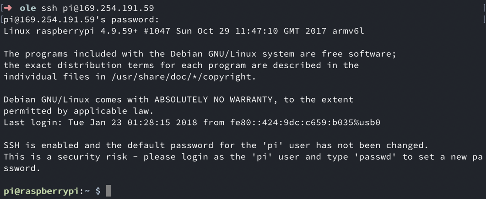

