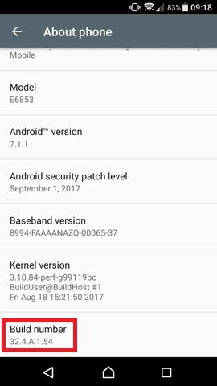
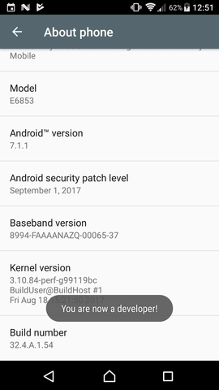
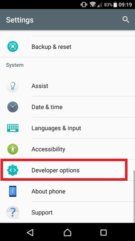
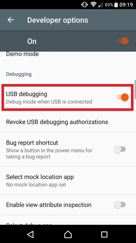
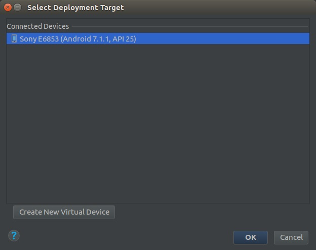

# Android Device Setup

Follow these steps to install and run the **Take Home** application on an Android device.

## Step 1: Setting up Your Device

Here we will show you how to activate "Developer Options".

* __Locate 'Build number' on your device.__

Follow these directories to find 'Build number' on a few popular devices.

    Stock Android: Settings > About phone > Build number
    Samsung Galaxy S5: Settings > About device > Build number
    LG G3: Settings > About phone > Software information > Build number
    HTC One (M8): Settings > About > Software information > More > Build number

An example of "Build number" from Xperia Z5.

* __Tap on the 'Build number' section 7 times.__

A message 'You are now a Developer!' will flash on your screen.

* __Go back to Settings main page.__

You can now see a new 'Developer options' section.

* __Go to 'Developer options' and check 'USB Debugging'.__

Select `OK` on the 'Allow USB debugging' pop-up.

* __Connect your device to the computer running Android Studio with USB to microUSB/Type C cable.__

You would see a 'USB debugging connected' notification from the drag down menu.

## Step 2: Install and Run Take Home on Your Device

* __Open Android Studio and locate Take Home project.__

On your computer run Android Studio, locate "Take Home" project.

    Windows default location: User/YourUsername/AndroidStudioProjects/
    Linux/Unix default location: ~/StudioProjects/

Then wait for Gradle to finish building the application. This process can take quite some times so please be patient. After the building process is done, then continue with the next step.

**NOTE**: If you don't have "Take Home" then you might have forgotten to clone it to your local machine. Please follow this guide on how to clone "Take Home". [Link]()

* __Go to menu bar and select 'Run app' from 'Run' drop-down menu in Android Studio.__

A list of connected and virtual devices will pop up.

* __Select `OK` on the Allow USB debugging pop-up on your device screen.__

You can check 'Always allow from this computer' to avoid doing it every time, before selecting `OK`. Now, your device name would appear on the above pop-op on Android Studio.

* __Click on your device name and click `OK`.__

The app would be installed on your phone as 'Planet' or 'Take Home'. This might take several minutes. In case there is another pop-op, select OK or install as appropriate.

Note: Configure and log into the app as you would on an Emulator. [You can see an example here](rbts-takehome-emulator-setup.md#Logging_in_on_Android_Emulator)
