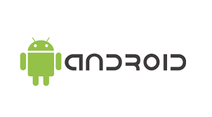

# Take Home Documentation
*Offline mobile build for Open Learning Exchange*



## Summary

We serve individuals in communities where amenities many of us take for granted are not readily available on a day-to-day basis. A constant connection to the internet with information and resources constantly at our fingertips is not something that everyone has access to. The goal is to make these resources available to devices that would otherwise be completely disconnected from the internet, or without a constant connection to a steady power source.

**How do we do this?**
We build an android app that connects to a RaspberryPi server running the BeLL App!

The RaspberryPi functions as the main hub for the data pertaining to the BeLL community. This is where the CouchDB is stored and where the information will be pulled for the Android application. This means that we need a two-way connection from both the RPi and the device.

When a connection is available to the server to download new resources (books, lessons, media, etc.), it can obtain them and then the user's mobile device can later download or access those files. Ideally, each time the app is opened on the mobile device, it will check for any differences between what is on the device and what is on the server and will sync and update accordingly. Furthermore, this should be done without the need for a connection to the internet.

## The Goal
We want Take Home to be a seamless and efficient tool for education no matter where the user is, even if they are not with the RPi server. We want to minimize the size of the app, and make it easier and more efficient to update while making updating a background process that requires little user input.

The Take Home app should be intuitive and user-friendly and keep in mind the limitations that our users might be faced with, such as lacking connection to the internet. The app should also work on various devices such as tablets and phones. The app should not require the most modern Android OS as this can limit our users that don't have access to the newest devices or an internet connection to update the device software.

We want to make use of all the resources that are available, such as wireless Bluetooth technology to augment and enhance user experience.

## Backend Workflow

WIP
To be written after more features are implemented successfully.

## Interacting with the RaspberryPi Server
The RPi server contains the CouchDB and the resources that we want the mobile device to be able to see. This is done by comparing what is on the device to the server which heavily relies on Json. Json finds the resources and version code of the apk and generates the list of resources and determines whether or not the application needs to sync with the server.

The way we do this can be seen in _FullscreenLogin.java_ where the following lines of code resides. 

```java
CouchDbClientAndroid dbClient = new CouchDbClientAndroid("members", true, url_Scheme, url_Host, url_Port, url_user, url_pwd);
	if(dbClient.contains(cls_memberId)){
		/// Handle with Json
		JsonObject json = dbClient.find(JsonObject.class, getMemberId());
		cls_serverNewTotalVisits = (getSumVisits() + Integer.parseInt(json.get("visits").getAsString()));
		json.addProperty("visits",cls_serverNewTotalVisits);
		dbClient.update(json);
	}
```

The [CouchDBClientAndroid class](http://www.lightcouch.org/javadocs/org/lightcouch/CouchDbClientAndroid.html) takes seven arguments and creates a client to CouchDB database server that runs on the Android platform. 
```String dbName, boolean createDbIfNotExist, String protocol, String host, int port, String username, String password```

The Json object is then created and uses the client to find the specified item or request and stores it using ```dbClient.find()```. Then the update is carried out or a "shadow list" is generated to display the contents of the server on the remote device.

(This section is incomplete as we are implementing generating lists and resources.)
WIP

## Tips for Using Android Studio

**Using Lint to clean up projects**
[Android Lint](https://developer.android.com/studio/write/lint.html) is an incredibly useful resource to keep the project files clean, organized, and optimized. Use lint to check that the project is structurally sound, and to remove any unused files to reduce the size of the project.

**Connecting Device to Android Studio For Testing**
It is also possible to connect a physical device to Android Studio for testing. You might need drivers specific to your device. Follow [this guide](https://developer.android.com/studio/run/device.html) for more details.

WIP

## The Future

**Syncing and Updating**
Currently, the application can sync with the RPi server and carry with it locally the same resources. An issue that stands in the way might be the method to connect to the server. Many solutions to this have been suggested, including implementing **Bluetooth** which modern RaspberryPis already have built in.


**A Different Platform**
We have also considered entirely rebuilding the app on a platform other than pure java. Suggestions have included:

- [**Cordova**](https://cordova.apache.org/)
- [**ReactJS**](http://blog.andrewray.me/reactjs-for-stupid-people/)
- [**Native**](https://ionicframework.com/)

If you have any ideas, please add suggestions to [the repository](https://github.com/open-learning-exchange/take-home).