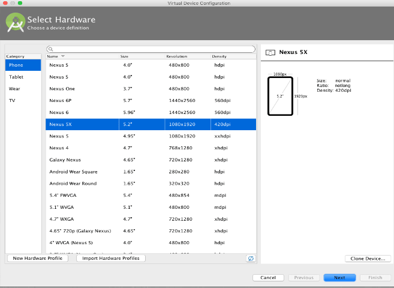
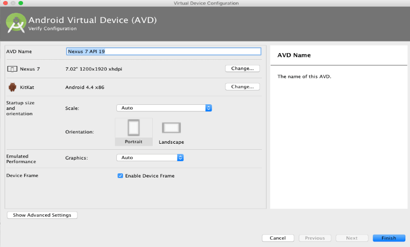

# Android Device Emulator

One of the deploment enviroments that you are going to be working in is Android Studio's Android device emulator. These Steps will guide you to get the emulator up and running.

## Android Studio Emulator Setup

When you first run the app you will get an error saying you are missing two .apk files. You can find the following files here:

- [firefox_49_0_multi_android.apk](https://drive.google.com/file/d/0Bw7aA5bLT2P9TTBNSDl3VzgtVnc/view)
- [adobe_reader.apk](https://drive.google.com/open?id=0Bw7aA5bLT2P9UmhlcHA1R1BoZnM) 

Download both files and put them into the take-home raw folder found here:

- take-home\app\src\main\res\raw

The app is now ready to run on an Android device. If you would like to run it in Android Studio's virtual device, you will have to create a new emulator as follows.

1. Click on the run button located at the top of your IDE. You will be prompted to Select Deployment Target. Select “Create New Emulator” button.


2. Select a device definition from the list provided and click the next button
           


3. Select system image from the list shown. API Level 22 and above works best. Preferably, choose 22 with Android 5.1. Click next to continue.
	


4. Name the emulator and specify the necessary configuration as shown below. Click on finish to save the emulator. 
	


5. You will be presented with the “Select Deployment Target” dialogue again . Choose the emulator we just created and click on the “OK” button.


6. The emulator will be opened with application installed. You have successfully configured the development environment to get you started.

Now you should be able to run the app in your virtual device.

## Logging in on Android Emulator
The Take Home application by default is setup to run on an actual Android device. You will need to modify the IP address in the Setup menu on the Member Login screen to be able to login successfully using the Android Emulator.

**Note:** *You need to have completed the [First Steps](http://open-learning-exchange.github.io/#!pages/firststeps.md) that relate to Vagrant in order for your Android Emulator to work. Make sure you can log-into MyBeLL before continuing these steps.*

First, you need to find your IP address.

For Windows, Open Command Prompt and type ```ipconfig``` in the window.


For MacOS(X) and Ubuntu, Open Terminal and type ```ifconfig``` in the terminal.


Secondly, you need to find your port number in MyBeLL.


Finally, You will combine both numbers into this format ```http://192.168.1.213:5985``` and then place it into the Setup menu inside the Take Home application.


After entering the IP and Port, click "Test". You should be prompted with a success screen.


You should now be able to sign into the Take Home application using the same login information that you use for MyBeLL.
