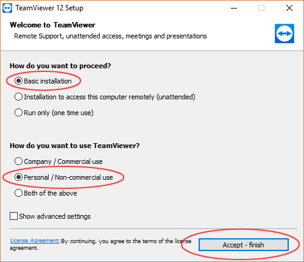
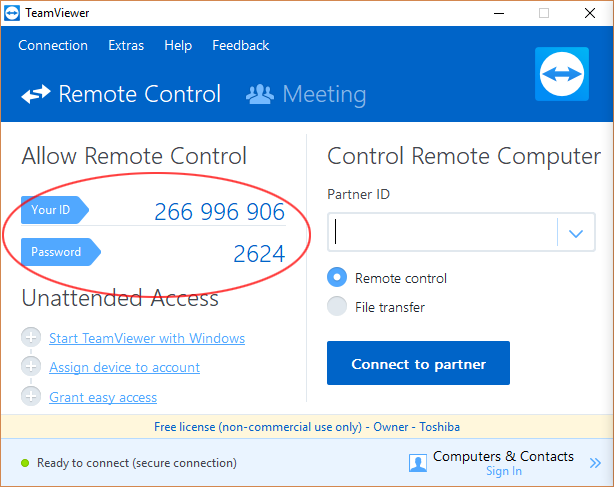

# TeamViewer

From time to time OLE may ask your to install TeamViewer to provide advanced troubleshooting support.

[TeamViewer](https://www.teamviewer.com) is a piece of software used for internet-based remote access and support. TeamViewer software can connect to any PC or Mac that is also running TeamViewer to allow remote control of the target PC as if you were sitting right in front of it.

## How To Grant Access with TeamViewer

1. Go to the [TeamViewer website download page](https://www.teamviewer.com/download). Download and install the TeamViewer package suitable for your operating system. Please make sure that you toggle the appropriate radio buttons as per the below image:

2. After TeamViewer is installed launch the application. Please share with OLE your ID number and password as per the below image.

