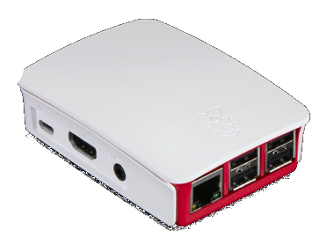
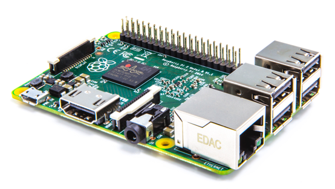
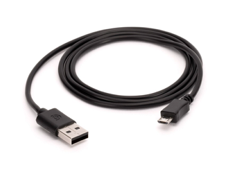
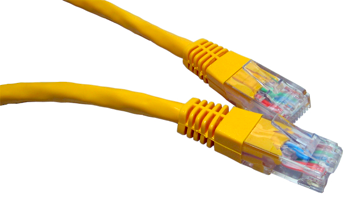
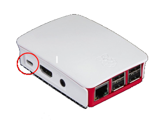
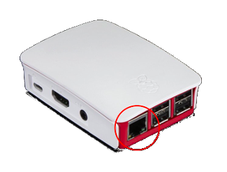
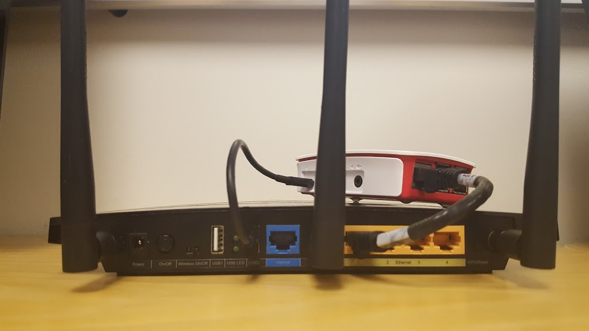
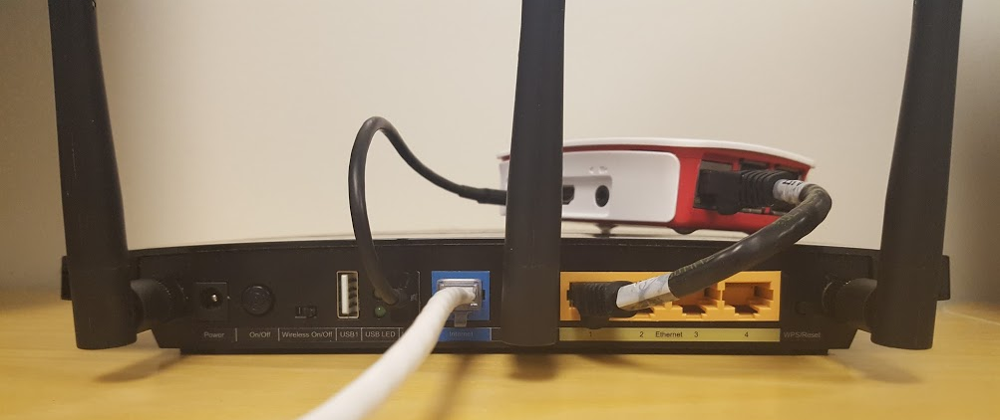

# Planet Quick Start Manual

This manual is designed to provide basic, step-by-step instructions for setting up the hardware for a Planet system based around a Rasperry Pi server. 

- [How do I Connect the Planet Hardware?](#How_Do_I_Connect_the_Planet_Hardware?)
- [How do I Connect the Community to the Internet?](#How_Do_I Connect_the Community_to_the_Internet?)
- [How do I Perform Connection Troubleshooting?](#)
- [Basic Troubleshooting](#Basic_Troubleshooting)

This manual assumes the reader possess some basic background on the Planet and ts functionality; however, it does not assume the reader has a technical or software background.

## How do I Connect the Planet Hardware?

The Planet system has two hardware configurations: Raspberry Pi and router configuration.

**Background** What is a Raspberry Pi? A Raspberry Pi (also referred to as an RPi) is low-cost and credit card-sized computer that stores data via microSD card. RPis are often used to teach people about computer basics and computer programming. There are also many higher-level applications that utilize the RPi due to low costs and considerable capabilities. In our case, it’s a very easy, small, cheap, and portable tool for our library. Check out [this video](https://www.youtube.com/watch?v=_cviTxswW8c) to learn more about the RPi.

Below are two images of the RPi with and without a case. 

 

In order to create networked access to Plannet we connect the RPi to a router. The RPi then provides IP addresses and other network services to the connected hardware. For documentation purposes we use either the TP-Link N600 or the N750 but these steps are largely generic and can be performed on any router that works with the RPi. 

Note: We recommend that talk to OLE technical staff before purchasing a router, as some of the newer routers do not work with RPis. Just check with us and we can suggest the best hardware for purchasing.

Connect these two devices (router and RPi) via two cables - a micro-USB to USB (on the left) and an Ethernet cable (RJ45) (on the right).

 

As you can see on the back of the router in the image below, there are a number of available ports and different uses for these port

 
*  Screw in the three antennae on the back of the router.

*  On the middle left back of the router there are two USB ports. Plug your USB cable into one of these slots and then plug the micro-USB into the RPi (there is only one micro-USB slot on the RPi).

*  Plug the Ethernet/RJ45 cable into the router via one of the *yellow* ports on the right. Then, plug the RJ45 cord into the RPi as show in the port below.

*  If your RPi and router connections look like the picture below then should be connected properly to your router. Congratulations!

*  Now that you have your router and RPi are connected, plug the router into a power source and turn it on to run your community. The power cable slot is located on the far left of the router. Plug the other end of the cord into a wall outlet or other power source.

*  There is a manual Power On/Off switch on the router that should be turned on (located on the far left; button should be pushed in). Once connected lights should begin to appear on both the router and the RPi.

## How Do I Connect the Community to the Internet?

You will occasionally need to plug your router and RPi to an Internet connection to receive weekly or biweekly software updates, new materials, surveys, courses, and other materials. In addition, you can send OLE user statistics via this connection so that OLE can improve the quality of your resources and Planet.

*  To start this process, you will need an additional Ethernet (RJ45) cord.

*  Plug one end into the center port of the router (blue) and then plug the other end into modem to connect to the Internet. The exact modem you are using will depend on your location and country.

*  When properly connected, the lights on your router and RPi should be on or flashing. You should now be able to access the Community. If the lights are flashing, than the connection is likely working.

## Basic Troubleshooting 

*  When errors or issues arise with the Planet hardware they are often the result of human error. The first step in troubleshooting is always to check the hardware connections - the USB, ethernet, and power cables. As hardware connections were covered above, please repeat the above step-by-step process.

*  Assuming that your hardware is connected correctly, the second most common problem is connectivity via router (seen as Wi-fi connectivity on the laptop or tablet). In our Community systems, we use an Intranet system (rather than Internet) to connect the tablets to the router/RPi where the tablets connect to a Wi-fi network. If the Wi-fi is not configured properly it will not work. Oftentimes, the Wi-fi is connected to the wrong network meaning that Communities cannot be accessed.

*  To troubleshoot this issue you will need a tablet. If you are facing a connection issue your screen will display something similar to screen shot below indicating that you are “Unable to Connect”:

Note: This Wi-fi connection was shown on OLE’s tablets that are currently used. However, the process of connecting to the Wi-fi should be largely the same on any system. The solution is to change the Wi-fi settings to the correct Wi-fi network.