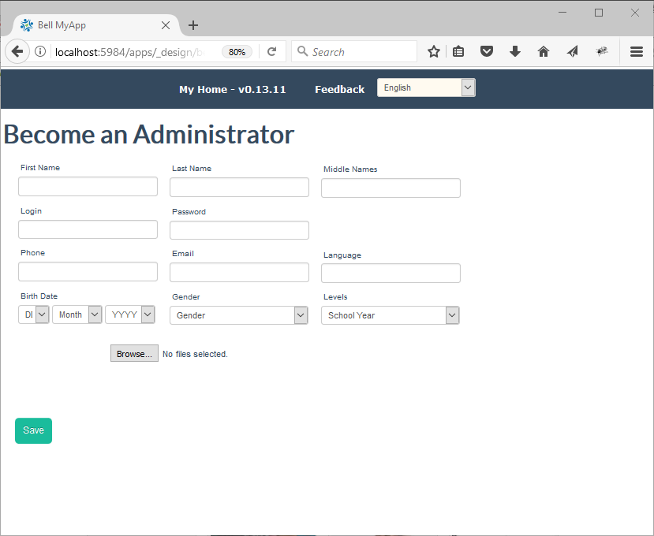
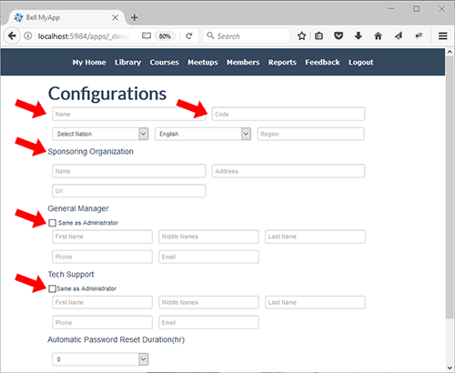
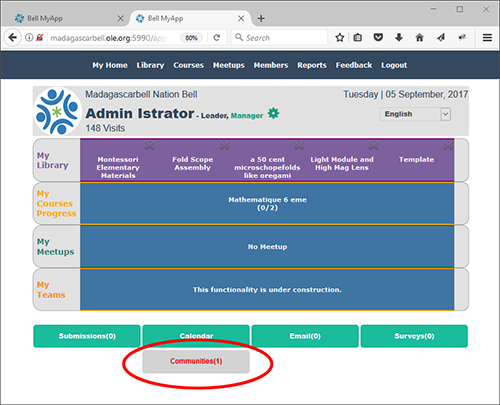
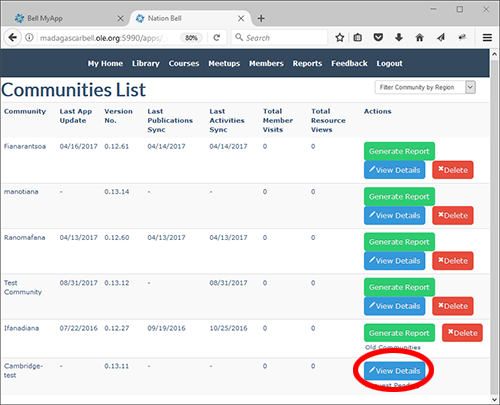
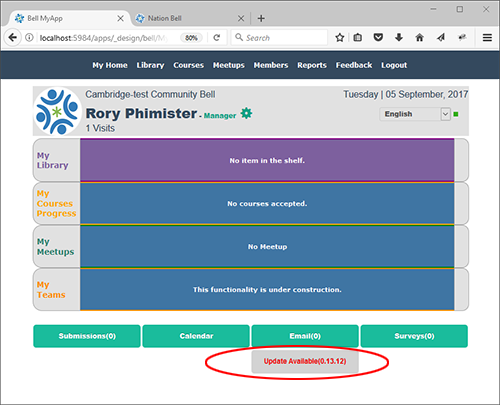
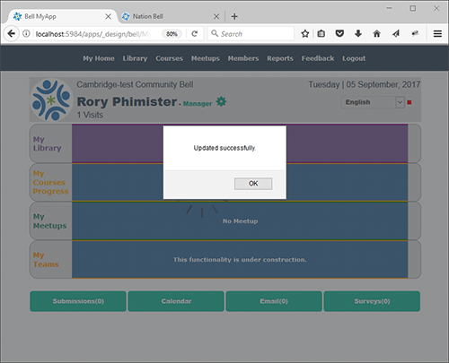

## Step 0 - Introduction

This document was created to meet the immediate technical support needs of the Madagascar Ministry of Education. However, we fully expect that this document will become the general use case for any partners that are on-boarding our program.

The team in Madagascar is working to establish a system for sharing digital content across schools at both the primary and secondary levels. This effort will begin with a pilot program at the Ministry to fully understand deployment challenges, and to upload existing content into a [National library](http://madagascarbell.ole.org) so that content can be shared quickly and easily with schools and educators around the country.

This effort will begin with the MOE establishing a number of local Communities on laptops at the MOE. Content will be loaded into community and pushed to the nation server. This strategy will allow the MOE to learn to use and deploy the system. It will also allow them to work offline, as bandwidth is a challenge.

## Step 1 - Prerequisites

It is understood that tech geniuses have completed [the First Steps training exercises](#!./pages/vi/vi-first-steps.md) and that they are familiar and comfortable with the deployment tools and methods. 

## Step 2 - Vagrant Environment Installation Confirmation

If you have completed the installation guide, then you will find `c:\users\USERNAME\ole--vagrant-vi` (In Windows) or `Users/USERNAME/ole--vagrant-vi` (In Mac) or `/home/USERNAME/ole--vagrant-vi` (In Ubuntu) under your file system. The `ole--vagrant-vi` directory indicates that this community is attached to the development environment that OLE uses for training and to develop, test, and deploy new features.

In the steps outlined below we will build a community that is attached to the Madagascar Nation. To achieve this we will do the following:

* Use git command line tools to [clone](#!./pages/vi/vi-github-and-repositories.md#Clone_your_GitHub_repository_username.github.io) the ole--vagrant-community repository to your local machine;
* Use Vagrant command line tools to start the new virtual machine; and
* Configure the new local Community so that it is connected with the Madagascar Nation.

## Step 3 - Vagrant

### How to Install a Community on a Local Laptop or PC

**If you are running Windows:**

Please open `git-bash` by pressing the Windows key to open the home screen, and then type "git bash" to bring up the Git Bash launch option. You can also use the command prompt or command prompt as an administrator.

**If you are running macOS or any version of Linux:**

Please open a terminal session.

**Next, enter the following commands at the command prompt:**

```bash
git clone https://github.com/dogi/ole--vagrant-community.git
cd ole--vagrant-community
vagrant up
```
Note: At this point you will have two virtual machines installed and running on your computer. In order to conserve hardware resources and to keep things clean and simple or in case you encounter an error, it is best to halt the original (ole--vagrant-vi) community.

```bash
# cd  to ole--vagrant-vi directory
vagrant halt
```

## Step 4 - Configure the new Community

Now that we have created a local Community, we'll need to configure it to connect with the Nation. This is done from the browser. Please start firefox and enter [http://localhost:8084](http://localhost:8084) into the address bar. When the Community loads you should see the following configuration screen:



Please enter and **record** details for the Community Administrator.

Click `Save` to continue.

This will bring you to the follow screen:



Please complete all fields as follows:

* Name = name of the school or community;
* Code = Same as the name field but ALL LETTERS capitalized with no spaces or special characters;
* Select Nations = MadagascarBell;
* Language = Your local language;
* Region = Your region of the world;
* Sponsoring Organizations Name, Address, and URL
* General Manager = Same as Administrator or fill in individual fields if different;
* Tech Support = Same as Administrator or fill in individual fields if different.

Click `Save` at the bottom of the page.

## Step 5 - First Time Login

Now return to the Community login page. [http://localhost:8084](http://localhost:8084). You should have full access to the community. However, it still must be activated by the administrator before you can upload/download resources, system updates, and user data. You can see that activation is pending because of the orange dot top right of the page as per below:


Once the Community registration has been accepted by the Nation Administrator the dot will be green.

## Step 6 - Accepting Community Registrations on the Nation

The Nation Administrator is responsible for accepting new Community registrations. The Nation Administrator will receive an alert on their system whenever a new Community is registered as in the below image:



To activate the new Community do the following:

* Login to the Nation with an Administrator account.
* Click on the New Community link at the bottom of the page (see above image);
* This will bring you to this page:



* click on Details to reach the confirmation page:


Click on Accept to complete the registration.

## Step 7 - Confirming Community Registration

After the Community has been verified and accepted by the Nation Administrator the Community Administrator will receive a confirmation dialogue and should see any available updates on the home page. The confirmation dialogue looks like this:


Notice that the orange dot is now green. Also note that there may be system updates that need to be applied. If available, you will find update alerts on the home page as in this image:



Warning: Running the system update can take time. Please only click the up date link once. Be patient! You will receive a confirmation dialogue once the update is complete. It will look like this:


