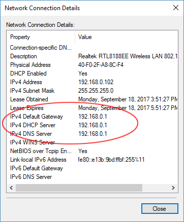

## Configuring Router/Network for Planet

## Introduction

This document explain how to pair the router with the Community Planet server in a local area network via a static IP address so that it can be found by local devices - tablets and laptops. This guide assumes that the Planet Community is installed on a windows machine. These instructions were written using screen shots from a TP-LINK router (TL-WDR3500 or TL-WDR3600) but you should be able to apply these instructions and concepts to any router. In order to complete these steps you will need access to access the management login credentials of the router. The default login for TP-Link router is username: “admin” and password: “admin” without the quotation marks.
Setup Diagram

## Router Configuration | Background

Many (not all) routers are pre-configured to assign dynamic IP addresses in the public address range 192.168.0.1 to 192.168.0.255 where 192.168.0.1 is the IP address of the router. The IP address of the router referred to as the Default Gateway Address. You can determine your router’s IP range by consulting the router documentation or by opening the admin control panel on the router. Most router admin panels can be accessed wirelessly with a web browser by going to the router’s Default Gateway IP Address. In the above example range this would 192.168.0.1. Any device that connects to a router via the gateway will be assigned a “dynamic” IP address within the IP range. A “dynamic” IP address is subject to change each time the device connects. While this makes networks very flexible, there are times when we do not want the IP address to change. We want it to be static. For example, in the case of IP printers. In our case, we want users to be able to find the Planet Community server at the same address every time. In order to make the device easily discoverable we will assign the Planet device a static IP address.

**Important Prerequisites**

1. This use case assumes that Planet is installed on a Windows-based laptop.

2. The Planet device should be connected to the router by WIFI NOT ethernet cable.

## Router Configuration | Assigning a Dedicated IP address to the Community

On a laptop open a web browser and type [http://tplinklogin.net](http://tplinklogin.net) or the default address of the router you are using, in this case [http://192.168.0.1](http://192.168.0.1) in the above example). 

If successful you will see the following dialogue box. Enter the credentials and click Log In:

Type the management credentials (“admin” and password: “admin”) or as per your device instructions;

If you do not get the login challenge then you can use ONE of the following TWO methods (Windows) to discover the Default Gateway:

_Via Command prompt_. Open the CMD window (press Windows button + R or search the Windows programs for “command prompt”). At the command prompt type “ipconfig” and press ENTER. Locate the Default Gateway - in this case it is 192.168.0.1.

 
_Via the Graphical User Interface_. Open Control Panel > Network and Sharing Center > Wi-Fi Connections (click link) > Details to get this dialogue box:

Click on DHCP

Click on DHCP Clients List and look for the name of the community laptop. Write down MAC address.

Click on “Address Reservation” and then “Add New”.

The resulting page needs to be completed. 

Copy the MAC address into dialogue box and enter “192.168.0.99” into the “Reserved IP Address” box. Click Save.

You will receive a notification that the new settings will not take effect until the router is rebooted. Click OK.

Manually reboot the router (press the On/Off button, wait 5 seconds and press the On/Off button again);

Enter the router admin panel and click DHCP Clients List. The community laptop should appear on the list with the assigned IP of 192.168.0.99 and the lease time of “permanent”.

## Connecting a tablet or computer to Planet

Connecting a tablet or computer to the new Planet community is relatively simple. 

In order to connect to the Planet Community server the tablet or PC must be on the same network as the server. 

On a Windows-based machine open the Settings > Network & Internet > Wi-Fi and select the correct network from the list of available networks. 

On an Android -based tablet go to Settings > Wi-Fi and select the correct network. 

## Testing Your Setup

Test this address in your Firefox browser: [http://192.168.0.99:5984/apps/_design/Planet/MyApp/index.html](http://192.168.0.99:5984/apps/_design/Planet/MyApp/index.html)  

Once the test is successful, bookmark this address on the tablets: [http://192.168.0.99:5984/apps/_design/Planet/MyApp/index.html](http://192.168.0.99:5984/apps/_design/Planet/MyApp/index.html)

## Troubleshooting

If you are unable to connect to the router’s Wi-Fi, then the router should probably be reset to factory settings.

Turn on the router and press the small RESET button on the back of the router, hold for 30 seconds and then release while the router is restored to factory default settings.

Start again.