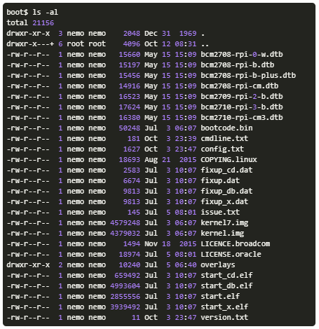

# How-To Install Bell-Apps on a Raspberry Pi 3

## Introduction

If you have completed [the on-boarding steps](#!pages/vi/vi-first-steps.md) as part of the Virtual Intern program then you have all of the skills and knowledge needed to complete an installation of Bell-Apps on a Raspberry Pi. 

Note: Although Bell-Apps will run on any hardware, we designed it for the RPi as it represents the most affordable option for delivering content and services. 

This installation guide is tailored for the RPi 3. It will configure the RPi to run a local Wi-Fi network that can serve content without a router. 

## Prerequisites

In order to complete this installation we will need a few hardware and software components as follows:

* A microSD card reader so that your computer can access the microSD card

* At least a 16GB microSD card. We recommend 32GB or greater

* Software for burning image to microSD card. We use [Etcher](https://etcher.io), but there are many from which to chose

* Unzipped [latest stable image for RPi](http://dev.ole.org/stable.img.gz)

* An internet connection and RJ45 Ethernet cable

## Installation Steps

1. Burn the image to the microSD card. This is a simple process with Etcher - select the image, select the microSD card and burn the image;

2. Once the image is completed unmount and remount the SD card so that you can view the contents. You will see a long file list as follows:

  

3. In order for the installation to complete we must create small text file called `autorunonce` and place it in the root directory of the SD card. 

Note: There are two versions of the autorunonce file. One for the RPi 3 alone and one for the RPi 3 + Real Time Clock (RTC).

  * Open any text editor (not a word processing program)

    * If you have the RPi 3 only, copy and paste [script/text found here](https://gist.githubusercontent.com/dogi/3a82a35b7f4adacac46e3eac08e6d9c0/raw/85291252133bf80eafd9b29eac59ed7b9b76ab7c/autorunonce) to the file

    * If you have **BOTH** RPi 3 **AND** RTC, copy and paste [script/text found here](https://gist.github.com/dogi/a3e9a0612d07436d5f7d2b3bb2051be3) to the file
 
  * Save the file with name `autorunonce` and place it in the `boot` partition of the microSD card. 

5. Unmount and remove the microSD card from the card reader and place it into the RPi.

6. Connect a RJ45 network cable to the Ethernet port on the RPi.

7. Connect the power. 
  
Note: The RPi will download content and reboot three times to complete the installation process. The first time you boot the RPi it connects to the Nation server to download the base library content. This is a large download. It can take 5 - 15 minutes or longer depending on your internet speed. This is a one-time process. Future boots will be much faster. 

6. Before we can access the new Bell-Apps, we need to connect to the local area network that was created by the installation script. Under your network settings, look for the network named "treehouse" and connect. 

Once the network connection is established, you should be able to access Bell-Apps by going to [the system login page](http://192.168.2.1:5984/apps/_design/bell/MyApp/index.html).
