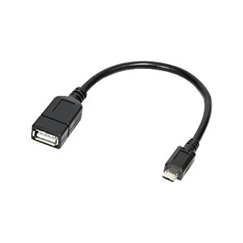
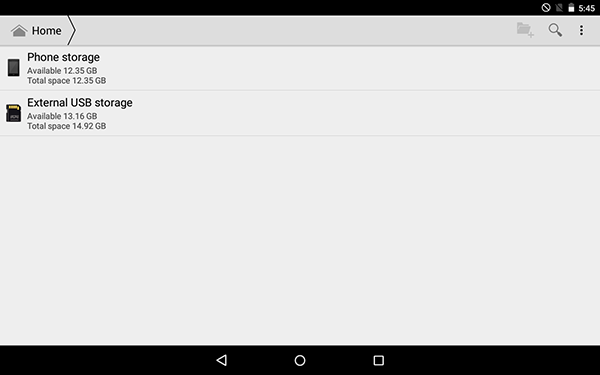
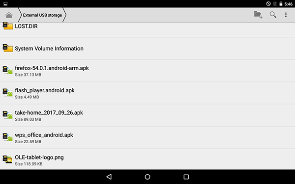
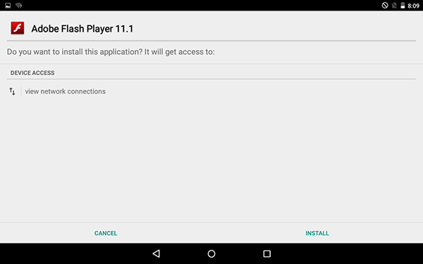
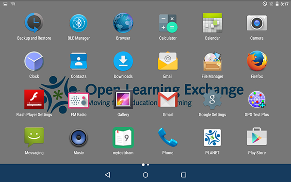
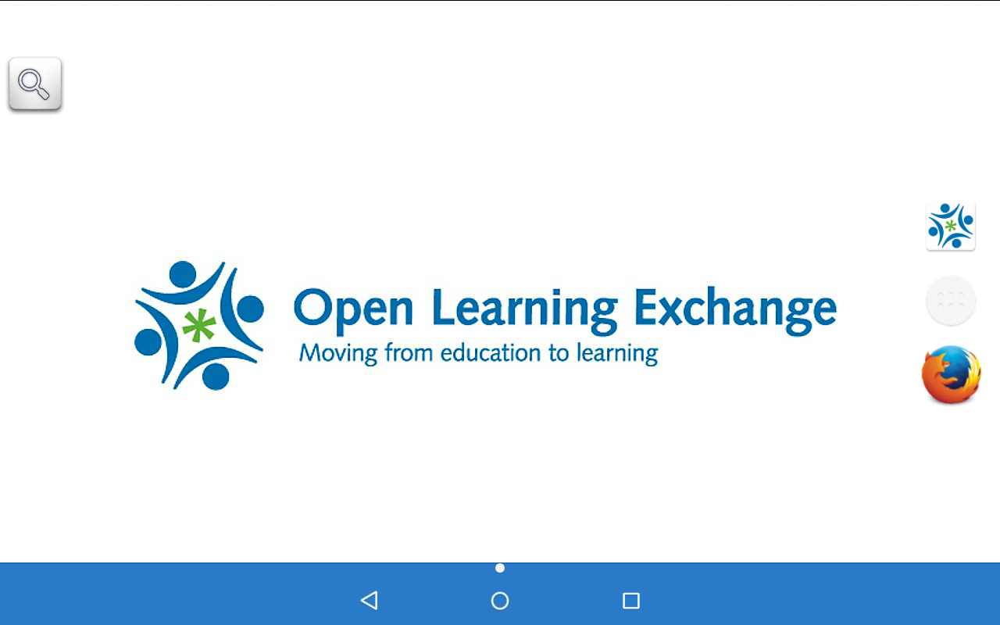
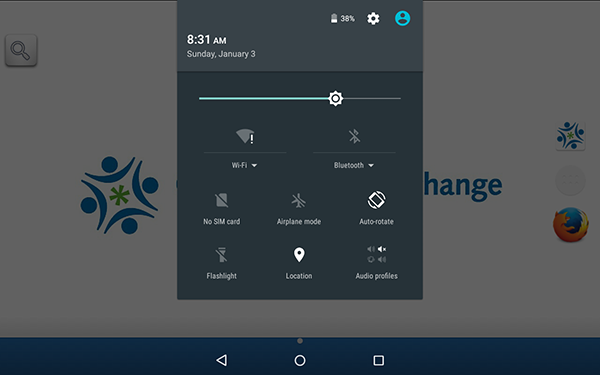
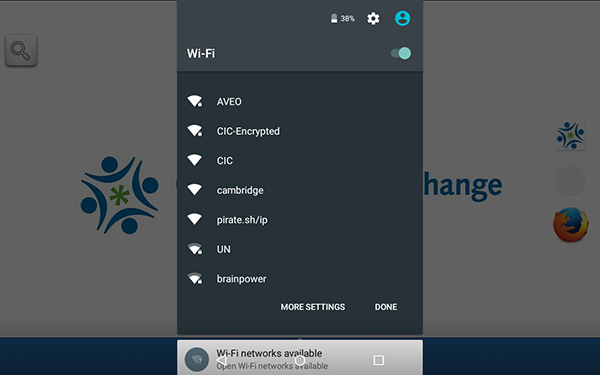
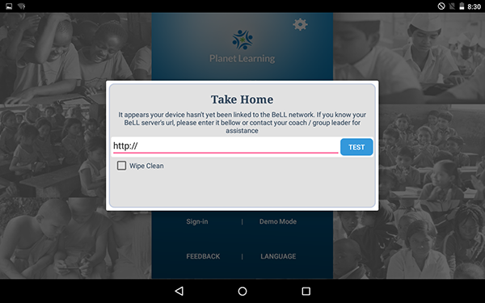
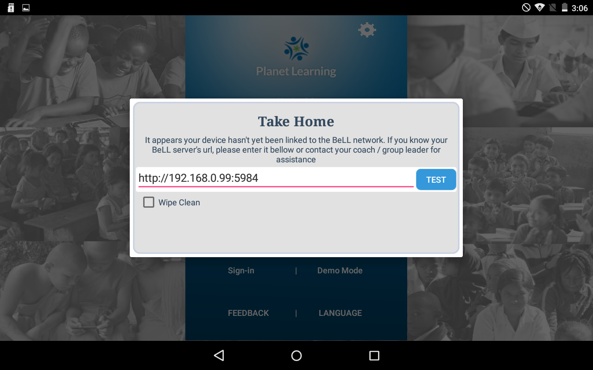

# Tablet Configuration

## Software

In order to make a tablet read for use with Planet Learning we must install four pieces of software, Firefox web browser, Adobe Flash Player, Office Suite, and the OLE Take Home application. 

There are two options for installing the software:

1. Direct download of the software to the tablet. This assumes a relatively fast internet connection. 
2. Download the software to a USB storage drive and install from the USB drive to the tablet. 

The easiest way to install the needed software to the tablets is via a USB drive. You can download the needed files directly from OLE via the links below.

*  [Firefox Web Browser](https://drive.google.com/a/ole.org/file/d/0BwJDzlwGL8kKcmJVOS14WkQ5d28 "Firefox Web Browser")
*  [Adobe Flash](https://drive.google.com/a/ole.org/file/d/0BwJDzlwGL8kKc29Xd0JueFN0TzQ "Adobe Flash")
*  [Office Suite](https://drive.google.com/a/ole.org/file/d/0BwJDzlwGL8kKa2UtTElTSFFTSWc "Office Suite")
*  [OLE Take Home App](https://drive.google.com/a/ole.org/file/d/0BwJDzlwGL8kKZzc4RDlfUTNpanc "OLE Take Hope App")

Once all files are downloaded to the USB drive you can eject the drive from the computer and plug it in to the tablet. You will need a USB A to USB C converter. It will look something like this:

Plug the USB into the tablet and follow these steps:

  * Open the Android File Browser and navigate to the USB drive.

  * You will see the list of APK installers that you copied to the USB Drive previously:

  * Double tap on firefox-54.0.1.android-arm to launch the firefox installer. 

  * Click `Install`.
  * Perform the same action for the other three APK installers.
 
## Add Icons to the Icon Bar

  * Access the main the icon menu:

  * Tap and hold the Planet icon and drag it to the main menu bar. Repeat with any other apps that you wish to include. Your tablet will look like this when done:

## Configure Tablet Network Access

  * Bring up the android configuration and settings menu by dragging your finger from the top of the screen:

  * Tap the Wi-Fi icon to bring up a list of available networks. Select the network associated with the Planet Community. In this example the network is named "pirate sh/ip"

## Configure the Take Home Application

In order to access the Planet we must configure the application to look for the local Planet Community.

  * Open the Take Home application. From the login screen select the configure icon at the top right.

* Enter the IP address of the local Planet Community. If you followed the guide to Planet LAN configuration the IP address will be 192.168.0.99.

Note: You must also include port number 5984 appended to the IP as follows: 192.168.0.99:5984.

Once the process is complete you can login to the Take Home application.
