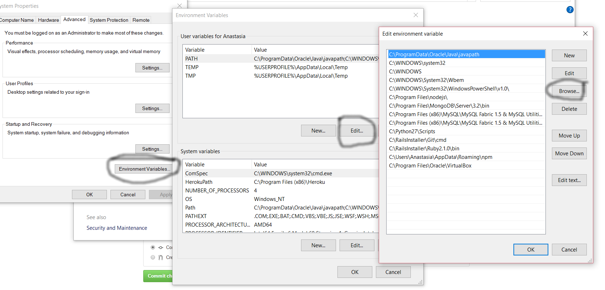

# Vagrant

[Vagrant](https://www.vagrantup.com/) is open source tool for building development environments. We assume that you have followed the first instructions on [README.md](https://github.com/dogi/ole--vagrant-bells) to install Vagrant and VirtualBox on your OS. Below you will find a shortened version on how to install this software quickly if needed as a reference. 

### Ubuntu
```
    sudo apt-get install virtualbox
    sudo apt-get install vagrant
```
### OSX
Open your `Terminal`. We assume that [brew](http://brew.sh/) is already installed.
```
    brew cask install vagrant
    brew cask install virtualbox
```
### Windows
You need to manually install git, virtualbox, and vagrant via internet from the installation links provided above. Afterwards, open your `Command Prompt` to check that the following are up and running properly:
```
vagrant --version
vboxmanage --version 
```
To run the vboxmanage --version command from your command prompt you can run the command by going into the directory where the executable is located or you can add virtualbox to path environment variables by doing the following steps :

<ol>
<li>Right click on Computer  
<li>Click on Properties  
<li>Click on Advanced System Settings which opens up a pop up box  
<li>Click on Environment Variables and use the System variables
<li>Click Edit `Path` in the System variables 
<li>Click new then browse the directory where your executable is located and click ok  
</o>  



---------------------------------------------------------------------------

After installing a communityBeLL on your OS, you will need to follow these instructions to use your communityBeLL. Vagrant only works when you have installed vagrant and you are in the proper directory where your vagrant file is located. To find the proper directory, open your `Terminal` or `Command Prompt` and type `cd ole--vagrant-bells/release` in order to be in the right directory. 
Now that you are in the right directory, check the status of vagrant with `vagrant global-status`. You should have the following message:

```
id       name   provider   state   directory
---------------------------------------------------------------------------
2198a3d  ole    virtualbox running /Users/Emily/ole--vagrant-bells/release

The above shows information about all known Vagrant environments
on this machine. This data is cached and may not be completely
up-to-date. To interact with any of the machines, you can go to
that directory and run Vagrant, or you can use the ID directly
with Vagrant commands from any directory. For example:
"vagrant destroy 1a2b3c4d"
```
If you have a different message, your vagrant is powered off, you have multiple machines of the same name, or you have another technical issue.

If your vagrant is powered off, use `vagrant up` to turn it on. To shut down your machine, use `vagrant halt`. These two commands require that you are in the right directory. To destroy your machine entirely, use `vagrant destroy`. Remember, by using `vagrant destroy`, you destroy the machine and will need to rebuild a communityBeLL if you wish to use it. It requires that you enter your password and this is not undoable. 

We suggest doing some light googling to tell you more about the background and commands of vagrant. Use `vagrant --help` for other commands that you may need. See `vagrant --help` below:

```
Usage: vagrant [options] <command> [<args>]

    -v, --version                    Print the version and exit.
    -h, --help                       Print this help.

Common commands:
     box             manages boxes: installation, removal, etc.
     connect         connect to a remotely shared Vagrant environment
     destroy         stops and deletes all traces of the vagrant machine
     global-status   outputs status Vagrant environments for this user
     halt            stops the vagrant machine
     help            shows the help for a subcommand
     init            initializes a new Vagrant environment by creating a Vagrantfile
     login           log in to HashiCorp's Atlas
     package         packages a running vagrant environment into a box
     plugin          manages plugins: install, uninstall, update, etc.
     port            displays information about guest port mappings
     powershell      connects to machine via powershell remoting
     provision       provisions the vagrant machine
     push            deploys code in this environment to a configured destination
     rdp             connects to machine via RDP
     reload          restarts vagrant machine, loads new Vagrantfile configuration
     resume          resume a suspended vagrant machine
     share           share your Vagrant environment with anyone in the world
     snapshot        manages snapshots: saving, restoring, etc.
     ssh             connects to machine via SSH
     ssh-config      outputs OpenSSH valid configuration to connect to the machine
     status          outputs status of the vagrant machine
     suspend         suspends the machine
     up              starts and provisions the vagrant environment
     version         prints current and latest Vagrant version

For help on any individual command run `vagrant COMMAND -h`

Additional subcommands are available, but are either more advanced
or not commonly used. To see all subcommands, run the command
`vagrant list-commands`.
```
### Useful  Links

[Instructions to install vagrant-README.md](https://github.com/dogi/ole--vagrant-bells)  
[Why to install Vagrant?](https://www.vagrantup.com/docs/why-vagrant/)  
[Vagrant Downoad](https://www.vagrantup.com/downloads.html)  
[Vagrant-Wiki](https://en.wikipedia.org/wiki/Vagrant_%28software%29)
