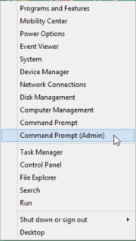

# Vagrant

[Vagrant](https://www.vagrantup.com/) is an open source tool to build development environments. We assume that you have followed the first instructions on [README.md](https://github.com/dogi/ole--vagrant-vi) to install Vagrant and VirtualBox on your OS. Below, you will find a shortened version on how to install this software quickly if needed as a reference.

## Prerequisites
Before installing Vagrant on any platform, it is necessary to check if VT-x/AMD-V instruction set is enabled on your processor. This is a requirement for installing vagrant on any platform since Vagrant is a type of virtualization software that utilizes VirtualBox. Most recent CPUs have this feature enabled already. If you are having trouble running vagrant, it may just be the case that VT-x/AMD-V is not enabled on your system. Please see the useful links section at the end of this page if you need more information on how to enable the VT-x/AMD-V instructions on your system. 

## Windows

Vagrant only works if you are in the correct directory, which is a directory that includes a file called Vagrantfile. In our case, the directory is ole--vagrant-vi.  Here, three options are provided for you to operate Vagrant.

**1. Command Prompt**

Sometimes there are two kinds of Command Prompt listed in your system. One is **Command Prompt**, and the other is **Command Prompt(Admin)**. As is shown below:



Basically, they are the same, the only difference is the default path. For **Command Prompt(Admin)**, the default path is `C:Windows\system32` and **Command Prompt** is `C:\Users\YOUR_USERNAME`.  You can use either **Command Prompt** or **Command Prompt(Admin)** to access the right directory for Vagrant.

**2. Windows PowerShell**

Windows PowerShell is a default shell interface installed in your machine. When you open it, the default path is `C:\Users\YOUR_USERNAME`.

**3. Git Bash**

Actually, **Git Bash** is also a good choice.  As you open **Git Bash**, you will find the default path of it is also `C:\Users\YOUR_USERNAME`.

As is mentioned above, the correct directory of Vagrant is `C:\Users\YOUR_USERNAME\ole--vagrant-vi`. So as long as you are at the correct directory, you can use any of those three options to run commands related to Vagrant. Among those three options we suggest mostly using `Git Bash`,  which is already installed with the ole--vagrant-vi script. In Git Bash, you use the same commands as those you would use in Powershell. Some basic commands of Vagrant are as shown below.

First of all, make sure you are on the path `C:\Users\YOUR_USERNAME`. Then if you type `cd ole--vagrant-vi` followed by `vagrant global-status`, you will see a screen similar to this,

```
id       name   provider   state   directory
---------------------------------------------------------------------------
219abaa  vi     virtualbox running /Users/aberdean/ole--vagrant-vi

The above shows information about all known Vagrant environments
on this machine. This data is cached and may not be completely
up-to-date. To interact with any of the machines, you can go to
that directory and run Vagrant, or you can use the ID directly
with Vagrant commands from any directory. For example:
"vagrant destroy 1a2b3c4d"
```

What this screen tells you is that you have a Vagrant virtual machine called `vi` running on VirtualBox. It also tells you the directory in which your Vagrantfile for that machine is located.

As you can see, in our case, the state of our machine is `running`. However, you can suspend your virtual machine issuing the command `vagrant suspend` or you can stop it completely with `vagrant halt`. In both cases, if you want to restart your machine, you will need to issue the command `vagrant up`.

When you issue the command `vagrant suspend`, your machine state will become `saved`, and after issuing `vagrant up` the machine will restart exactly from the point is was at when you suspended it. On the other hand, when you issue the command `vagrant halt`, the state will become `poweroff`, and after issuing `vagrant up` the machine will restart from the initial state it was at when you first installed it.

Another command that may be sometimes useful is `vagrant destroy`, which allows you to delete your virtual machine. In this case, you will have to rebuild a new machine from scratch, if you ever need to use the machine again.

You may want to try and issue the above commands on your system, to get familiar with Vagrant, since that will prove useful later on, during your internship.

## Ubuntu
```
    sudo apt-get install virtualbox
    sudo apt-get install vagrant
```
## MacOS(X)
Open your `Terminal`. We assume that [brew](http://brew.sh/) is already installed.
```
    brew tap caskroom/cask
    brew cask install vagrant
    brew cask install virtualbox
```

---------------------------------------------------------------------------

After installing a community BeLL on your OS, you will need to follow these instructions to use your community BeLL. Vagrant only works when you are in the same directory where your Vagrantfile is located. To make sure you are in the proper directory, open your `Terminal` and type `cd ole--vagrant-vi`.
Now that you are in the right directory, check the status of your Vagrant machine with `vagrant global-status`. You should have the following message:

```
id       name   provider   state   directory
---------------------------------------------------------------------------
2198a3d  vi     virtualbox running /Users/Emily/ole--vagrant-vi

The above shows information about all known Vagrant environments
on this machine. This data is cached and may not be completely
up-to-date. To interact with any of the machines, you can go to
that directory and run Vagrant, or you can use the ID directly
with Vagrant commands from any directory. For example:
"vagrant destroy 1a2b3c4d"
```
If you have a different message, either your Vagrant machine is powered off, or you have multiple machines with the same name, or you are experiencing some other technical issue.

If your Vagrant machine is powered off, use `vagrant up` to turn it on. To shut down your machine, use `vagrant halt`. Both of these commands need to be issued within the right directory. To destroy your machine entirely, use `vagrant destroy`. Remember, by using `vagrant destroy`, you destroy the machine and will need to rebuild a community BeLL if you wish to use it at a later time.

We suggest doing some light googling to find out more about the background and commands of vagrant. Use `vagrant --help` for other commands that you may need. See `vagrant --help` below:

```
Usage: vagrant [options] <command> [<args>]

    -v, --version                    Print the version and exit.
    -h, --help                       Print this help.

Common commands:
     box             manages boxes: installation, removal, etc.
     connect         connect to a remotely shared Vagrant environment
     destroy         stops and deletes all traces of the vagrant machine
     global-status   outputs status Vagrant environments for this user
     halt            stops the vagrant machine
     help            shows the help for a subcommand
     init            initializes a new Vagrant environment by creating a Vagrantfile
     login           log in to HashiCorp's Atlas
     package         packages a running vagrant environment into a box
     plugin          manages plugins: install, uninstall, update, etc.
     port            displays information about guest port mappings
     powershell      connects to machine via powershell remoting
     provision       provisions the vagrant machine
     push            deploys code in this environment to a configured destination
     rdp             connects to machine via RDP
     reload          restarts vagrant machine, loads new Vagrantfile configuration
     resume          resume a suspended vagrant machine
     share           share your Vagrant environment with anyone in the world
     snapshot        manages snapshots: saving, restoring, etc.
     ssh             connects to machine via SSH
     ssh-config      outputs OpenSSH valid configuration to connect to the machine
     status          outputs status of the vagrant machine
     suspend         suspends the machine
     up              starts and provisions the vagrant environment
     version         prints current and latest Vagrant version

For help on any individual command run `vagrant COMMAND -h`

Additional subcommands are available, but are either more advanced
or not commonly used. To see all subcommands, run the command
`vagrant list-commands`.
```

## Useful  Links
Instructions to enable virtualization for [Windows](https://www.howtogeek.com/213795/how-to-enable-intel-vt-x-in-your-computers-bios-or-uefi-firmware/) | [Macintosh](http://kb.parallels.com/en/5653) | [Ubuntu](http://askubuntu.com/questions/256792/how-do-i-enable-hardware-virtualization-technology-vt-x-for-use-in-virtualbox)  
[Instructions to install Vagrant - README.md](https://github.com/dogi/ole--vagrant-vi)  
[Why to install Vagrant?](https://www.vagrantup.com/docs/why-vagrant/)  
[Vagrant download](https://www.vagrantup.com/downloads.html)  
[Wikipedia page on Vagrant](https://en.wikipedia.org/wiki/Vagrant_%28software%29)
[Other helpful links and videos](faq.md#Helpful_Links)
   
#### Return to [First Steps](firststeps.md)
