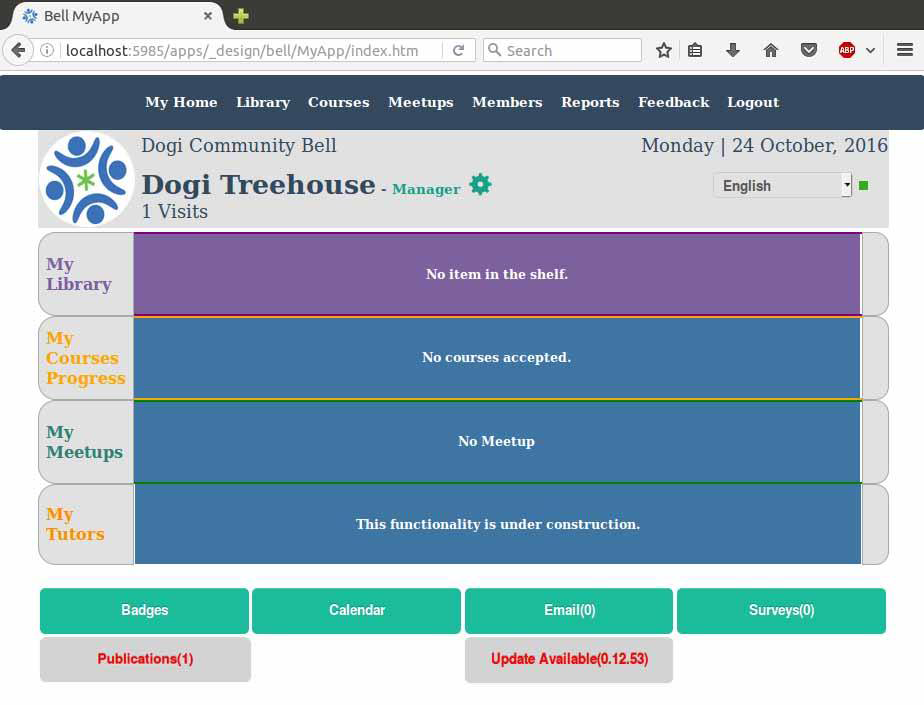
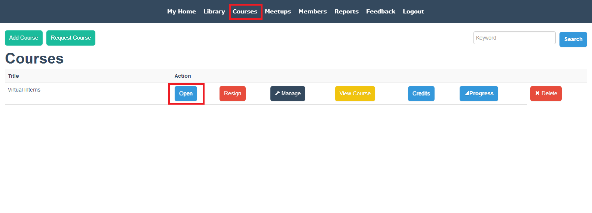

# BeLL-Apps: Communities and Nations

## Objectives

* Understand how the BeLL-Apps interface is structured
* Understand basic functions of community BeLL
* Add resources to your Community in order to get accustomed to the BeLL-Apps interface

## Watch Videos

Watch the videos below to learn the basic functions of your BeLL. These videos were created a few years ago, but they should do a decent job of introducing you to the BeLL.

[My Dashboard](movies/vi-mydashboard.mp4)
[Library](movies/vi-library.mp4)
[Feedback](movies/vi-feedback.mp4)
[Generating Activity Reports](movies/vi-generatingactivityreports.mp4)

We suggest you to play around a bit, try to explore and feel comfortable with BeLL.

## Upload Resources

In this section, we will practice uploading resources to the BeLL. Although there are several kinds of resources, the majority of them are PDFs, mp3s, and mp4s.

Here are three type of resources that you can download to your computer and then upload to your BeLL. Right-click on each one of these links and save them to your computer.

[PDF - "Feelings"](pdf/vi-feelings.pdf)
[mp3 song - "Opposite Song"](music/vi-oppositesong.mp3)
[mp4 video - "Burka Avenger"](movies/vi-burkaavenger.mp4)

Next, go to [your community BeLL](http://127.0.0.1:5985/apps/_design/bell/MyApp/index.html). Select `Library` from the dashboard, then select `Add a Resource`. You will see:

Fill out the information:

- As we are just doing this as a practice, accuracy of information/source of content is not very important.
- It is important to choose the correct resource format from the `Open` drop-down (e.g., PDF, mp3, or mp4).
- Make sure to have something in all of the drop-down menus and text boxes.

Next, click on `Save`. You have now uploaded the resource. You should be able to find the resource in Library, make sure that you can open it. Repeat the same process for all three resources.

Do not forget to send the screen shot of your community configurations (from earlier when you registered your configurations) to our chat. In case you forgot to take the screen shot of your configurations, go to the dashboard, click on manager, click on the configurations tab, take a screen shot of the page, and send it to the Gitter chat.

## Different Kinds of Updates to Your Community

There are three other important kinds of updates that you receive on the community side: updates, publications, and surveys. 

As you can see from the image below, there is an update ready to be downloaded. Usually, next to the update, you should also see publication(s) (we send to you from the nation) ready to be downloaded.

- First, click the "Update Available" button and it will reload your homepage with a successful update message. An update refers to a software update which improves the BeLL. If you do not see "Update Available" button then simply carry on.
- Next, click on "Publications", under the Manager page, and sync the publications. Publications add new resources or courses to your library.
- Last, repeat the process of sending an activities sync to the nation.

**NOTE**: If there is an "internet connection" error when you click the "Update Available" button, change your browser to Firefox.

## Take the Course

We created a course for aspiring virtual interns so that we could test the software used to build courses and find bugs/things to improve. It is your job to take the course and find out what needs to be fixed/improved from the student standpoint.

Take the course, and the last question will ask you to specify any problems or improvements/suggestions that you have. Remember, people taking these courses in remote areas of the world will probably run into the same problems if you do not raise them now and let the team know. This is a very important task, and your help is much appreciated.

**STEPS:**
1. Click on Courses on the top navigation
2. Find the course "Virtual Interns," click on Admission
3. Click on Open
4. Carefully finish 12 steps of the course
5. When you provide feedback, try to be as specific as possible, and include screen shots when necessary

## Introduction to Planet

As we stated earlier in the first steps, we are currently rewriting BeLL using Angular. The repository is called [planet](https://github.com/ole-vi/planet). Head over to the [installation guide](#!pages/robots/rbts-angular.md#Installation) to quickly get Planet up and running. At current stage, it does not matter what nation/community you select. After logging in, please explore around and post a screenshot to the Gitter chat.

## Useful Links

[Helpful links and videos](vi-faq.md#Helpful_Links)

#### Return to [First Steps](vi-first-steps.md#Step_4_-_BeLL-Apps_Tutorial)
