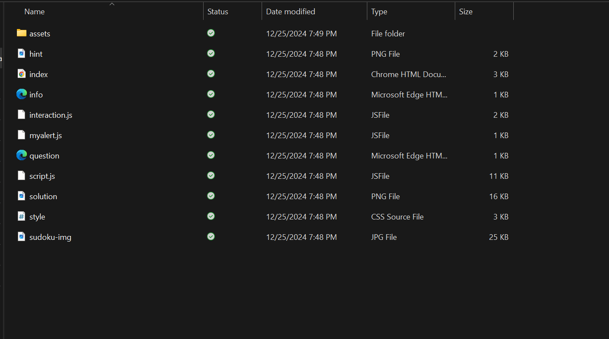

# Create More Issues and Pull Requests (Step 8)
**Estimated Time: 4.5h** 

## Objectives

- Create three more issues
- Add comments to three other issues
- Resolving three issues

## Introduction

Just as your learning with this Wiki was made possible by the efforts of previous interns, now we turn to you to continue that tradition and help future interns take their First Steps. Through this step, you should try to further improve our Markdown Wiki, with better explanations, formatting fixes, and more! You must have made your pull requests and have them each approved by at least two other OLE team members/interns in order for it to be merged to the upstream repository. Just as before, announce your Pull Request on the Discord channel so other members can review it. You may need to make some additional corrections. Learn by teaching - or editing our teaching tool, in this case!

## ToDo

In this step, your goal is to create, comment on, and resolve GitHub issues to improve our Markdown Wiki. Here's what you'll need to do:

1. **Create Issues**:
  - Create 3 new issues in our GitHub repository regarding Software Engineering Virtual Intern First Steps's content or [Planet User Manual](#!pages/manual/planet/overview.md).
  - Each issue should focus on a specific problem or improvement.
    - Ensure that **at least one issue** addresses content reduction, such as dead links, repetitive content, excessive detail, or the potential to reference external official documentation in Virtual Intern First Steps.
    - Ensure that **at least one issue** is about populating or improving the [Planet User Manual](#!pages/manual/planet/overview.md) page.
2. **Comment on Issues**: Provide helpful comments on at least 3 existing issues that you did not create. This could be to provide feedback, suggest solutions, ask questions, or clarify the issue.

3. **Resolve Issues with Pull Requests**: Resolve the 3 issues by making the necessary changes in separate branches derived from `master` in your repository, and submit a distinct pull request for each one.

Follow the **same process** as described in the [GitHub Issues Tutorial step](vi-github-issues.md), working to improve our documentation for future interns. To get your pull requests merged, they must be approved by at least two other OLE team members/interns. After creating a pull request, announce it on the Discord chat to request reviews. You may need to make additional corrections based on feedback.

You are encouraged to post as many issues as you can for improving the page as well as for personal practice. Remember, even small issues are worth addressing and it is OK if you are not sure how to fix it yourself. If you know how to solve an issue, be sure to provide a detailed account of your research and show how to fix it. It is ok to file an issue about minor typos and very small grammar changes, but do not make this the case for all of the issues that you file.

**NOTE**: While adding details can be helpful, it's important to remember that less is often more. Over time, this First Steps guide has become bloated with too much information, making it harder to follow. As you work on improving this guide, focus on simplifying the instructions and removing any unnecessary content. The goal is to create a clear and concise guide that future virtual interns can easily understand and use.

**HINT**: While waiting for two OLE team members to approve your Pull Requests, you can continue creating more Issues and Pull Requests (upon approval, we suggest). They will all count towards your final Issue/PR total. PR approval can take time, so don't let a lengthy approval/fix process stop you from progressing in your "First Steps".

## Adding HTML Games on Planet.vi

In this section, you will learn how to add HTML games to Planet.vi. Follow these steps carefully, and make sure to reference the screenshots provided for better clarity.

### Steps to Add HTML Games:

#### **Step 1: Visit the Planet.vi Website**
- Go to [https://planet.vi.ole.org/](https://planet.vi.ole.org/).
- **(Screenshot of the homepage)**

#### **Step 2: Sign In or Register**
- If you already have an account, sign in.
- If you don’t have an account, click on "Become a Member" to register.

#### **Step 3: Navigate to the Library**
- Once signed in, go to the Library section.
- Click the "+" icon to add new resources. For this tutorial, you'll add HTML games.
- **(Screenshot showing the Library and the "+" button)**

#### **Step 4: Prepare Your HTML Game**
- Research or create an HTML game. You can use GitHub or other online resources as references. Be creative!
- Test your game locally to ensure it works as expected.

#### **Step 5: Example: Sudoku Game**
- For guidance, here is an example of a simple Sudoku game. You can use a single `.html` file or include multiple files if needed.
- **(Screenshot showing Sudoku game content)**

#### **Step 6: Organize Your Files**
- Put all your files in a single folder.
- Create a `.zip` file of the folder. Here's how to create a `.zip`:
  - Select all files.
  - Right-click and choose "Compress" or "Create Zip."
- **(Screenshot showing the folder and zip creation process)**

#### **Step 7: Upload Your Zip File**
- Click "Choose File" and upload your `.zip` file. For example, "sudoku.zip."
- **(Screenshot showing the file upload screen)**

#### **Step 8: Fill in the Details**
- Complete the required fields (e.g., name, description, tags).
- Add the game to the "HTML Apps" collection by clicking "Add Collections."

#### **Step 9: Specify the Open With File**
- If your zip file contains multiple files, specify the main `.html` file (e.g., `index.html`) in the "Open With" field.
- **(Screenshot showing the Open With field populated)**

#### **Step 10: Submit the Game**
- After filling in all the details, click "Submit."
- **(Screenshot showing the submission confirmation)**

#### **Step 11: Test Your Game**
- Search for your game in the Library and test it to ensure it works properly.
- **(Screenshot showing the game in the Library)**

#### **Step 12: Success!**
- Congratulations! You have successfully added your first HTML game. Play and test it to ensure everything works.
- **(Screenshot showing the game in action)**

## Track Your Progress

- After completing Step 8, you should have:
  - 5 merged pull requests (one from Step 1, one from Step 6, and three from Step 8)
  - 4 comments on *issues you didn't create* (one from Step 6 and three from Step 8)
  - 4 issues created (one from Step 6 and three from Step 8)

Hint: You can track your progress with the number of pull requests and issues [**here**](../track-first-steps-progress.md).

---

**→** Next: [Step 9 - Planet Development Setup](vi-docker-development-tutorial.md)

Return to [First Steps](vi-first-steps.md#Step_8_-_Create_Issues_and_Pull_Requests)
