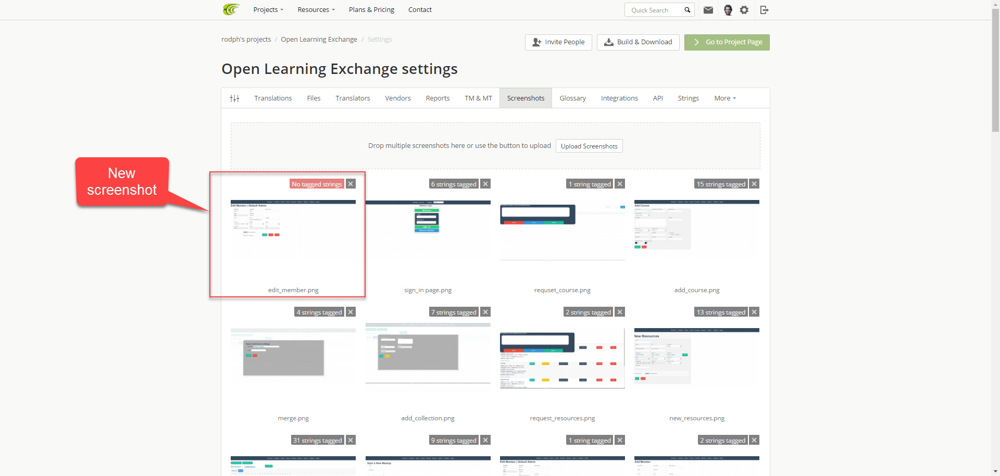

[Google Doc](https://docs.google.com/document/d/1gsDmBSq5Tu1G_Ei1CfTRUuvvwpAWUPhHYr2UYESwISI/edit?usp=sharing)

# Crowdin Integration

## Objectives

* Provide exactly one screen shot for the strings in BeLL app and tag it.
* Write good descriptions for the strings in Context.

These objectives will make more sense as you go through the steps. Before we get to the steps, you should know what strings are, and what tagging is. 

### Strings:

>A string is a word or a sentence that describes the functionality of a button, or the title of a page on BeLL app. See the figure below. It shows the different strings on the main page of Bell App. Strings are highlighted with red squares.

### Tagging:

>Tagging in Crowdin is similar to tagging your friends on Facebook except here we tag strings on a screen shot.

Now that you know what strings are and what tagging is, let’s show you how to accomplish the objectives above.

## Objective 1: Providing and Tagging Screen Shots:

There are two major steps to accomplishing this objective which encompasses smaller steps.

### Step 1: Find the string in BeLL app:

>The goal in this step is to go through a list of strings, and for each string in the list, try to find where it might appear in BeLL app. Then, take a screen shot of the page where you found the string. Here are the steps to do that.

1.1- Go to Crowdin either by clicking [here](https://crowdin.com/project/open-learning-exchange/invite), or by clicking the Translation tab on the MDwiki for Virtual Interns. See the figure below.

1.2- In Crowdin main page, click on any language. I chose Arabic, but you can choose something else. See the figure below.

1.3- After you choose a language, click on OLE OpenBeLL Interface file. See the figure below.

1.4- When you click on the file, the list of strings will be on the left side of the page. Note that there are 15 pages in the list. See the figure below.

Now that you found the list of strings, go through each string and do the following:

1.5- Make sure it is not tagged:

>To find out if a string is tagged or not, simply click on it, and then look at the middle section of the page. If you see a screen shot, move on to the next string, but if you do not, go to step 1.6. The figures below show a tagged and an untagged string respectively.

1.6- Take a screenshot:

>Click through the BeLL app to find the string. Once you see the string in the app, take a screen shot of the page and save it.

To see examples of screen shots, click on a tagged string, and take a look at the screen shot of that string.

##### Tip

>When you see an untagged string, it might be helpful to ask yourself where can you find the string in the app? For example, where do think the string “compose” can be found? The most likely place is in the email page. Go there and take a screen shot if it is not already tagged. 

### Step 2: Upload and Tag Screen Shots

#### 2.1 - Uploading Screen Shots

2.1.1- If you are in OLE OpenBell Interface file, go to the main page by clicking [here](https://crowdin.com/project/open-learning-exchange?auto_accepted=13039143), or click Project > Open Learning Exchange Page. See the figure below. If you are in the main page, Click the Settings button.

#### Note

>In Open Learning Exchange Crowdin Project, Emily has made you a manager. As a manager, you should be able to see the Settings button on the main page of Crowdin. See the figure below. If you do not see the Settings button, please let Emily or Dogi know in the chat.

2.1.2- Click the Screen Shots tab. See the figure below.

2.1.3- Upload the screen Shot you saved in Step 1 either by dragging and dropping, or click the Upload Screen shots button. See the figure below.

2.1.4- After the upload is completed, you will see your screen shot right below the upload section to the left. See the figure below.

#### 2.2 - Tagging Screen Shots:

Now that you uploaded the screen shot, let’s tag it.

2.2.1- Click on the screen shot you uploaded.

2.2.2- Activate Text Recognition either by pressing “T” on your keyboard or by clicking the T button on the upper-left corner of the page. See the figure below.

2.2.3- Highlight/tag the string. Once you do, the string will appear in a text box. The figure above shows a number of tagged strings.

2.2.4- Make sure that the text in the text box matches the string on the screen shot. Sometimes, Text Recognition will see different text. If you cannot see the whole text in the text box, expand the box by dragging the lower-right corner of the box. See the figure below.

2.2.5-Save your tags by clicking the Save button on the upper-right corner of the page.

##### Text Recognition Cannot Recognize a String:

If Text Recognition cannot recognize the string on the screen shot. Follow the steps below:

1- Activate Drag and Drop either by pressing “H” on your keyboard, or click the hand on the top-left corner of the page. See the figure below.

2- The list of strings will appear on the right side of the screen. Search for the string you want to tag.

3- Simply drag the string and drop it over the string you want to tag, then adjust the size of the text box so that it covers the intended string. See the figure below.

You are now done with the first two objectives! Repeat these steps for half of the strings on the list. 

## Objective 2: Writing Context:

>Provide a good, strong, and thorough description of the strings.

1- Follow steps 1.1-1.4 to get to OLE OpenBeLL Interface file.

2- Go through the list of strings, click Edit Text (see the figure below), and write good context of the strings.

Hurray! You have completed the instructions for Crowdin Integration.