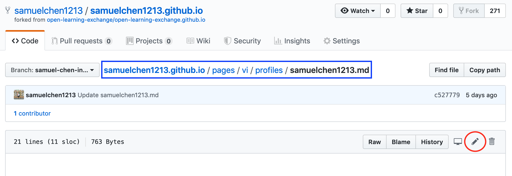

# GitHub and Markdown

## Objectives

* Learning about Github and the Markdown wiki.
* Writing your own individual Markdown wiki page.
* Understanding the Github workflow (including forks, repositories, commits, and pull requests).

## Prerequisites

You must already have a GitHub account with verified email address.

[GitHub](https://help.github.com/categories/writing-on-github/) acts as a source code management system for Open Learning Exchange. Please, read some of the basic instructions below to learn how we use GitHub at OLE.

[Markdown Wiki](http://dynalon.github.io/mdwiki/#!quickstart.md) is the software we use for our Virtual Intern website. Markdown (MD) Wiki allows us to use Markdown on GitHub so that it is easily compatible with our current development environment. To put it simply, Markdown is a markup language that is very easy to learn and allows you to quickly format your text.
In the screen shot below, you can see an example of Markdown syntax on the left side and the way it is rendered on the right side:

    

#### Markdown != HTML

Below is a cheat sheet of Markdown to help you create your own individual MD Wiki page:

[Markdown Tutorial](http://tylingsoft.com/tutorial.md/#whats-markdown)

You can also find a bigger cheat sheet with examples [here](https://github.com/adam-p/markdown-here/wiki/Markdown-Cheatsheet)

If you want more practice using Markdown, check out [this site](http://www.markdowntutorial.com/lesson/1/) to explore the MD syntax and see results as you type.

The main GitHub page used to store this MDwiki can be found at [open-learning-exchange/open-learning-exchange.github.io](https://github.com/open-learning-exchange/open-learning-exchange.github.io) and our virtual interns will essentially create their own MDwiki repository as a copy of open-learning-exchange.github.io.

## Start here

This is just a summary of the steps that you will need to perform. Please, keep on reading for a detailed explanation of each step.

* [Login to Github with your username and password](#Login_to_Github_with_your_username_and_password)
* [Find and fork the correct repository](#Find_and_fork_the_correct_repository)
* [Go to Settings and rename your repository](#Go_to_Settings_and_rename_your_repository)
* [Post a link to your repository in chat](#Post_a_link_to_your_repository_in_chat)
* [Create a new file as your personal MDwiki page and commit your changes](#Create_a_new_file_as_your_personal_MDwiki_page_and_commit_your_changes)
* [Open a pull request](#Open_a_pull_request)

### Login to Github with your username and password

Since you have already created a username on GitHub, we can assume that you understand the basic layout and functionality. If you don't, please, explore and do some basic googling. When you're editing on GitHub, it is important to always make sure you are working on your own GitHub repository. To that end, make sure there is your own username before the slash and the correct repository after the slash. For example, EmilyLarkin/BeLL-Apps). All of Open Learning Exchange's work can be [found here](https://github.com/open-learning-exchange). All the different repositories represent different types of software used by OLE, and the repositories act as categorizing system.

There is a lot to learn about GitHub, but to acclimatize you to it, we will provide a basic example of how to change something on GitHub. This example will specifically create your own &lt;username&gt;.github.io and allow you to edit and commit your changes.

**NOTE**: Existing Github users, please make sure to set your email address per local repository or make sure global settings are accurate. Follow [this](https://help.github.com/articles/setting-your-email-vi-git/) for more information.

### Find and fork the correct repository

First, you will need to find the correct GitHub repository to fork. Forking is essentially creating a copy of a repository on your own GitHub account, to avoid editing and, possibly, messing up with the main repository. To make it easier on you, we will provide you with a link to the correct repository [here](https://github.com/open-learning-exchange/open-learning-exchange.github.io). Now, you will fork the repository to your own account. Look at the picture below to find the fork button.

### Go to Settings and rename your repository

After you fork the repository, you will be on your page: &lt;username&gt;/open-learning-exchange.github.io. Then, you should go to Settings at the top middle of the page and rename your repository to your GitHub username. See example below.

### Post a link to your repository in chat

After you rename it, make sure to post a link to the github.io website you've just created (&lt;username&gt;.github.io) in the [gitter.im chat](https://gitter.im/open-learning-exchange/chat).

> @dogi  please look at  https://YourUserName.github.io 

Don't worry if you see a **404** when you access the link, it will take a while for the page to be up and running. Make sure in **Settings > GitHub Pages**, the **source** is set to **_master branch_**.

**NOTE**: Always pay attention when you are working on GitHub, to make sure you work on your own personal account and not on Open Learning Exchange GitHub account. Once again, it is very important to distinguish between your personal GitHub account and the Open Learning Exchange account. As we want to keep a 'clean' version of our code, everyone forks the repositories, commit their changes to their own personal version of the repository, and then send the changes back to the Open Learning Exchange repository for approval (called a pull request), before the Open Learning Exchange code is updated.

Please, make sure to ALWAYS work on your own personal account via forking and pull requests.

### Create a new file as your personal MDwiki page and commit your changes

 Before creating your file create a new branch using the branch drop down menu as shown below. Click on the Branch drop down menu and name your branch(you can give any name to your branch) then click Create branch. Once you are done with that now you can see that your branch is listed in the menu.

 To create your page click on the `pages/vi/profiles` folder. Then, click New File and name the file exactly the same as your GitHub username. We created pages for you using your GitHub username, so it is important that you stick with that name. For reference, an example of a link to a personal page is [https://github.com/kylemathias/kylemathias.github.io/blob/master/pages/vi/profiles/kylemathias.md](https://github.com/kylemathias/kylemathias.github.io/blob/master/pages/vi/profiles/kylemathias.md), so yours should be named in the same manner, only using your username.

In the new file, please type your name, your location/time zone, and OS (including version). In addition, make sure to add a short description of yourself as well, so your fellow virtual interns know who you are. Also try to use several Markdown elements in your page to get an idea for how it works.

We recommend using at least 5 different types of Markdown elements and to try to be as creative as possible. Some good examples of profiles are:
- [Profile 1](profiles/Loshma93.md) links
- [Profile 2](profiles/i5o.md) picture
- [Profile 3](profiles/paulbert.md) lists

If you need to edit your file again, just click the pencil icon to edit (as shown below).

  

Now, check what this looks like on your own page `https://rawgit.com/YourUserName/YourUserName.github.io/YourBranchName/#!pages/vi/profiles/YourUserName.md` and post a link to it in the [gitter.im chat](https://gitter.im/open-learning-exchange/chat). Check and double check that everything looks good and is working before initiating a pull request.

**NOTE**: If you don't see any changes in your page after editing your file then you need to clear your browser's cache or open your page in your browser's **"incognito"** or **"privacy"** mode. You can also press Ctrl+Shift+R or Ctrl+F5 to reload the page with cache cleared.

### Open a pull request

Then, you can create a pull request by clicking the `Pull requests` button and then clicking `New pull request`.   

 

Finally, click `Create pull request` and someone from our team will review the changes.   

 

Often there will be some feedback from the reviewer at this point for you to address. If that is the case, make changes to your branch and comment on the pull request when done. Any changes you make to your branch will automatically affect the pull request. Once everything looks good, the reviewer will merge your page with the main repository.

After the pull request is completed, you'll be able to see this on open-learning-exchange.github.io in addition to your personal page. Let us know when you have completed this step in the [gitter.im chat](https://gitter.im/open-learning-exchange/chat).

**NOTE**: Try to add and experiment with as many markdown elements as you can and make your page attractive. A list of sample profile pages can be found [**here**](https://github.com/open-learning-exchange/open-learning-exchange.github.io/tree/master/pages/vi/profiles). Be creative.  
Make sure to include a rawgit link to your page in your pull request.

## Useful Links

[GitHub: Writing and Formatting](https://help.github.com/categories/writing-on-github/) - A Github help page on how to format and write, along with working with saved replies.
[Markdown](http://dynalon.github.io/mdwiki/#!quickstart.md) - A more descriptive Github guide on more markdown syntax.
[Markdown Interactive Tutorial](http://www.markdowntutorial.com/lesson/1/) - An awesome interactive tutorial to experiment and learn more Markdown syntax with.
[Mastering Markdown](https://guides.github.com/features/mastering-markdown/) - The official Github Guide for Markdown syntax
[How to fork a repo](https://help.github.com/articles/fork-a-repo/) - A more in depth explanation about how and why we fork repositories from Github.
[Comparison of markdown and html](http://thebridge.jp/en/wp/wp-content/uploads/2013/05/markdown-vs-html.png) - The general comparison of markdown and html.
[Other helpful links and videos](vi-faq.md#Helpful_Links)

#### Return to [First Steps](vi-first-steps.md#Step_3_-_Markdown_and_Fork_Tutorial)
