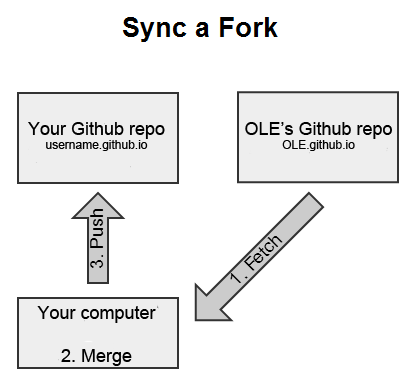

# Git Repositories (Step 5)

## Objectives

- Learn how to **use Git from the command line**
- Understand how to configure and sync a repository with the forking workflow

## Introduction

On GitHub, software code is organized into repositories, each representing a different project. For example, you've been working on one of our repositories, **open-learning-exchange.github.io**. We encourage you to explore our other repositories on GitHub [here](https://github.com/open-learning-exchange), but remember: **look, don't touch**. If you are new to Git or GitHub, take a look at [this introduction](https://www.freecodecamp.org/news/introduction-to-git-and-github/).

As previously mentioned, in the [forking workflow](vi-github-and-markdown.md#2.3_Introduction_to_Forking_Workflow), you fork a repository to work on it independently from the upstream repository, then send your changes back to the original repository via a pull request. You completed this process on github.com in [Step 1 - Markdown and Fork Tutorial](vi-github-and-markdown.md). In this step, we'll dive deeper and use the command line to sync your forked repository with OLE's upstream repository.

The diagram below shows the structure of the forking workflow for open-learning-exchange.github.io, with a central upstream repository, individual forks, and local copies on your machine.


## Important Terms

In this step, you'll encounter some common terms, such as

- `master`/`main`: a repository's default branch name
- `upstream`: the repository you forked from
- `origin`: your own fork of the upstream repository
Both `upstream` and `origin` are considered **[remote](https://git-scm.com/docs/git-remote)**. Also, remember that a repository can contain multiple branches.

## 1. Clone Your GitHub Repository

### 1.1 Clone with HTTPS or SSH?

Both HTTPS and SSH URLs allow you to access the same remote repositories, but they use different protocols. You can choose either based on your preference:

- **HTTPS:** Easier to set up for beginners, doesn't require SSH keys.
- **SSH:** More secure, requires you to have SSH keys set up on your machine and added to your GitHub account.

For more details, check [Cloning a repository | GitHub Docs](https://docs.github.com/en/repositories/creating-and-managing-repositories/cloning-a-repository).

#### To clone with SSH

1. [Verify you have existing SSH keys on your machine](https://docs.github.com/en/authentication/connecting-to-github-with-ssh/checking-for-existing-ssh-keys).
2. [Add the SSH key to your GitHub account](https://docs.github.com/en/authentication/connecting-to-github-with-ssh/adding-a-new-ssh-key-to-your-github-account).

### 1.2 Clone Your Repository

1. Open a command prompt/terminal window and visit your `<YourUserName>.github.io` repository on GitHub.
2. Click the green "<> Code" button to get the repository's URL. Copy the HTTPS or SSH link.
3. Navigate to the `ole` folder you create in [Step 2's "Preparation" section](vi-prerequisites.md#Preparation), or to a directory of your liking using the command prompt/terminal. **[Guide for Command Line](https://www.codecademy.com/articles/command-line-commands)**
4. In your command line interface (CLI), type `git clone ` and paste the copied link. It should look similar to:
   - **HTTPS:** `git clone https://github.com/<YourUserName>/<YourUserName>.github.io.git`
   - **SSH:** `git clone git@github.com:<YourUserName>/<YourUserName>.github.io.git`
5. Hit Enter. If the repository is cloned successfully, you can now `cd` into your `<YourUserName>.github.io` directory to see its contents.

## 2. Explanation About Repositories and Syncing Process


The previous step created a clone of your repository on your OS.

Now, there are three levels of repositories to keep in mind:

1. **Upstream Repository on GitHub:** `open-learning-exchange.github.io`
2. **Your Fork on GitHub:** `<YourUserName>.github.io`
3. **Your Local System Clone:** `<YourUserName>.github.io`

These repositories must be consistently synced and up-to-date with each other since we all contribute to the upstream repository (open-learning-exchange.github.io). It's crucial to keep changes separate and avoid mixing them between repositories. Significant differences can cause conflicts and prevent you from performing `git push/pull` operations smoothly.



## 3. Configure a Remote Repository for Your Fork

To fetch updates from the upstream repository, configure it as follows:

1. Open your command prompt/terminal and navigate to the repository directory:

  ```bash
  cd <YourUserName>.github.io
  ```

2. List the current configured remote repository:

  ```bash
  git remote -v
  ```

  This should show:

  ```bash
  origin  https://github.com/<YourUserName>/<YourUserName>.github.io.git (fetch)
  origin  https://github.com/<YourUserName>/<YourUserName>.github.io.git (push)
  ```

3. Add the upstream repository:

  ```bash
  git remote add upstream https://github.com/open-learning-exchange/open-learning-exchange.github.io.git
  ```

4. Verify the upstream repository is configured correctly:

  ```bash
  git remote -v
  ```

  This should show:

  ```bash
  origin  https://github.com/<YourUserName>/<YourUserName>.github.io.git (fetch)
  origin  https://github.com/<YourUserName>/<YourUserName>.github.io.git (push)
  upstream  https://github.com/open-learning-exchange/open-learning-exchange.github.io.git (fetch)
  upstream  https://github.com/open-learning-exchange/open-learning-exchange.github.io.git (push)
  ```

## 4. Sync Your Fork

1. Fetch branches from the upstream repository:

   ```bash
   git fetch upstream
   ```

2. Check out your fork's master branch:

   ```bash
   git checkout master
   ```

3. Merge the upstream/master with your local repository:

  ```bash
  git merge upstream/master
  ```

  If Vim editor shows up for commit message, use `:wq` (**w**rite and **q**uit) to exit with the default message.

4. Push the updates to your repository:

  ```bash
  git push origin master
  ```

## Summary of Steps

Generally, follow these commands in your command line, but refer back above if there are any errors or further questions about why you are writing any of the following commands

#### Clone your GitHub repository &lt;YourUserName&gt;.github.io

1. Open your command prompt/terminal and find the correct directory
2. Copy the HTTPS or SSH link from your repository on the GitHub site
3. On the command line, type `git clone *paste your HTTPS or SSH link here*`

#### Understand that there are three levels of a Github repository

- the upstream ([open-learning-exchange.github.io](https://github.com/open-learning-exchange/open-learning-exchange.github.io))
- &lt;YourUserName&gt;.github.io on GitHub
- &lt;YourUserName&gt;.github.io on your OS.

These need to be synced and checked constantly.
The **upstream repository** is the one we are contributing to.

#### Configure the upstream repository to your fork

1. `cd <YourUserName>.github.io.`
2. `git remote -v` see above to make sure you are pushing and fetching to your own repository on GitHub as the origin
3. `git remote add upstream https://github.com/open-learning-exchange/open-learning-exchange.github.io.git`
4. `git remote -v` origins should remain the same, but you should also be fetching and pushing to OLE as the upstream now

#### Sync Your Fork

1. `git fetch upstream` -  to fetch branches from the upstream repository ([more info](https://git-scm.com/docs/git-fetch))
2. `git checkout master` - to checkout the `master` branch ([more info](https://git-scm.com/docs/git-checkout))
3. `git show-branch` - to see branches and the changes made in them ([more info](https://git-scm.com/docs/git-show-branch))
4. `git merge upstream/master` - You repository should now be synced to upstream/master ([more info](https://git-scm.com/docs/git-merge))

#### Make sure your repository is up to date

1. `git diff` - for comparing different versions of the same file ([more info](https://git-scm.com/docs/git-diff))
2. `git status` - to view the changes made in the branch, whether the branch is up-to-date with master ([more info](https://git-scm.com/docs/git-status))
3. `git pull` - to sync the local repository with the remote repository ([more info](https://git-scm.com/docs/git-pull))
4. `git push` - to push the updates that you made to the local repositories to the GitHub repositories ([more info](https://git-scm.com/docs/git-push))

**NOTE**: Developers should always sync their fork and make sure their repositories are up to date with GitHub every time they begin to work. This way we as a team can minimize data loss, and can save you some time.

#### If you find yourself needing to rebase your forked repository, the following two links should help

- [Rebase](https://git-scm.com/docs/git-rebase)
- [Branching Rebasing](https://git-scm.com/book/en/v2/Git-Branching-Rebasing)

**NOTE**: While rebasing and merging are similar, there is a difference between them. Merging takes all changes in one branch and merges onto another branch in one commit. Rebasing moves the branch's starting point to another place. For example, if you rebased your branch to the master branch, then your branch now incorporates all the changes made in the master, and every time master is changed, your branch is changed as well. In contrast, merging is a one-time change.

For more info on differences of merging vs. rebasing (and when to use which one), [check this out](https://www.atlassian.com/git/tutorials/merging-vs-rebasing)

If you would like to understand how syncing with the fork works, here is a useful [video](https://www.youtube.com/watch?v=-zvHQXnBO6c)

## Useful links

- [Configure a remote for fork](https://docs.github.com/en/pull-requests/collaborating-with-pull-requests/working-with-forks/configuring-a-remote-repository-for-a-fork) - You can sync changes made in the original repository with a fork.
- [GitHub Help: Syncing a Fork](https://help.github.com/articles/syncing-a-fork/) – Sync a fork of a repository to keep it up-to-date with the upstream repository.
- [GitHub tutorial](http://product.hubspot.com/blog/git-and-github-tutorial-for-beginners) - An Introduction to Git and GitHub for beginners from HubSpot.
- [Git-it Workshop](http://jlord.us/git-it/) - Runs in your terminal to work and provides a hands-on approach to learn Git and GitHub repositories.
- [Git help](https://git-scm.com/) - An encyclopedia of useful git workflows and terminology explanations.
- [Other helpful links and videos](vi-faq.md#Helpful_Links)

---

**→** Next: [Step 6 - GitHub Issues Tutorial](vi-github-issues.md)

Return to [First Steps](vi-first-steps.md#Step_5_-_Keeping_Fork_Updated)
