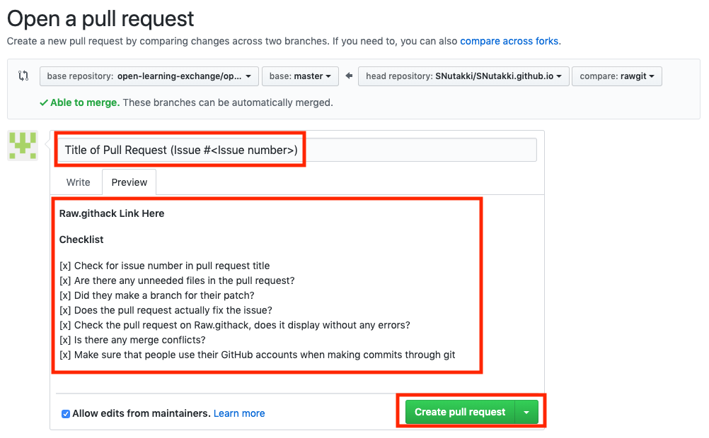

# GitHub Issues

## Objectives

* Learn about Issues, Commits, and Pull Requests
* Understand the collaborative git/GitHub work-flow that will be used throughout the internship
* Create an issue, and upon admin approval, create a branch to fix it
* After resolving the issue in the branch, make a pull request to the [upstream repository](https://github.com/open-learning-exchange/open-learning-exchange.github.io)
* Work with admins to make adjustments if necessary, and merge your branch into the upstream

## Introduction

On GitHub, each repository has a section where issues can be added, discussed, and fixed as a means of categorizing and addressing problems we find. Issues are often opened by our team to fix software bugs on the BeLL and in our code.

Note: Issues are not just about adding to the wiki, but can also involve removing repetitive or unnecessary code or content.

Below, you'll find an example of an issue where I brought up a problem, researched an answer, and then fixed the issue.

We encourage you to file as many issues as you can, no matter how big or small. If you notice something, but are not sure how to solve it, file an issue anyway to let others know about it. If you do not know how to, let others know about it so it can be fixed. Try to provide as much value with your issues and to the community to improve this section for all. Below, you'll find an example of an issue where I brought up a problem, researched an answer, and then fixed the issue.

## Create an Issue

First, you will need to open an issue within the right repository ([upstream repository](https://github.com/open-learning-exchange/open-learning-exchange.github.io)) and explain the problem. If you are explaining a bug or how to replicate an issue, please be as explicit as possible and use pictures if possible.

After this, you will then research the possible solutions or ideas on how to address the issue and write a comment with this information, as you can see [here](https://github.com/open-learning-exchange/open-learning-exchange.github.io/issues/15). Someone else will hopefully provide input (as Dogi did here) and then you can move ahead with making the proposed changes.

## Create a New Branch

Every time you start to work on an issue you need to create a branch to keep your work on various issues separate from each other. Before you create your branch, sync your repo following the process in the [previous step](vi-github-and-repositories.md). Then use `git checkout -b name_of_your_new_branch` to create and switch to a new branch on your local repository. More documentation on checkout can be found [here.](https://git-scm.com/docs/git-checkout)

Now when you make changes to files on your local machine, you are actually making changes to files in your new branch. If you switch back to master, the files on your local machine revert to how they were before you made changes, since you are no longer on the new branch created.

Now you can go and make the proposed changes to your local files.

Note: Use `git branch` to see which branch you are in.Your Master branch is the base working branch. It needs to remain untouched just in case you need to revert some changes back to a working version. Make sure you are on right branch using `git checkout branch-name` while making proposed changes to your local files and while committing.

If you're still confused, that's quite alright. The data flow of GitHub can be quite challenging at first. See this diagram below. For better context, the new branch you just made is inside your "Forked Github IO".

## Create a Commit

After you are done making your changes, use the `git status` command to see which files in the working directory have been modified. If you wish to stage all of the modified files shown, use the `git add .` (The '.' is part of the command.) command. Otherwise you can choose only the file or files you wish to stage by using the `git add <file1> <file2> <file3>...` command. Now that you have selected the files you wish to include, use the commands `git commit -m "commit message"` and `git push -u origin name_of_your_new_branch` to save your changes and push them to your Github (for any further commit on the same branch after the first one, you can just use `git push`).

### Commit Message Style Guide

Because the commits you will be making on this markdown wiki are fairly basic, it is not necessary to enforce a wordy commit style. However, in the future, when you start to work on more complex projects, it is helpful to write your commit messages in a certain way. Here is an article on [how to write good commit messages](https://chris.beams.io/posts/git-commit/).

For edits to this markdown wiki, we recommend that your commit messages only consist of the subject line (refer to the article for more on what the subject is). Rules 2-5 are the most important:

* Limit the subject line to 50 characters
* Capitalize the subject line
* Do not end the subject line with a period
* Use the imperative mood in the subject line

Here is an example of how you would write your commit message:
`$ git commit -m "Add commit message style guide and add Rawgit section (fixes #841)"`

NOTE: in your commit message, if you add a keyword like "fixes" or "resolves" followed by "#" and the issue number, once your pull request is merged, the issue will automatically be closed. This is helpful because it helps declutter the issues section. See more [here](https://help.github.com/articles/closing-issues-using-keywords/).

## Rawgit

Rawgit is an important aspect of the pull request process. After you commit changes to your local branch and push them to your remote branch, you can view these changes by going to `https://rawgit.com/{YouGitHubUsername}/{YouGitHubUsername}.github.io/{YourBranchName}/#!index.md`and viewing the page(s) you have changed. You may need to change the link slightly depending on where the file you want to view is located. If everything looks correct, you are ready to create a pull request.

For example http://rawgit.com/EmilyLarkin/EmilyLarkin.github.io/master/#!index.md will result with this:

Rawgit makes it easy to see what the page will look like if your branch is merged, so don't forget to include a rawgit link in your next step, the pull request.

## Create a Pull Request
If you login to your own fork of OLE on Github, Github will notice that you recently pushed a new branch. The fork can be found via `https://github.com/YourUsername/YourUsername.github.io`, replacing YourUsername with your own details. Press the green button that says Compare & pull request. In this new page, you can change the title and comments for the PR. Once you are done with filling out these forms, submit the pull request by clicking on the green create pull request button.

For everyone's convenience, we highly recommend that you follow a certain structure when submitting a pull request. We suggest to include the issue for which the pull request is resolving (for example, if your pull request fixes the issue number 320, then add `#320` to your pull request) to the title of your PR and also the rawgit link into the description of the pull request. This saves a lot of time for the person reading your pull request as he/she does not need to search and match the issues with the corresponding PR and is able to instantly see the changes pushed via the rawgit link.

Additionally, creating a checklist will help others understand what you have done and what needs to be done - it helps you coordinate with your team members with the issues you are facing in an organized manner. GitHub will render the task list in markdown, and it will look similar to something like the checklist shown below this paragraph.

[x] Check for issue number in pull request title
[x] Are there any unneeded files in the pull request?
[x] Did they make a branch for their patch?
[x] Does the pull request actually fix the issue?
[x] Check the pull request on rawgit, does it display without any errors?
[x] Is there any merge conflicts?
[x] Make sure that people use their GitHub accounts when making commits through git

Some of these items are of course optional, but try to include as much useful information for others as possible in your checklists because nobody really wants to work on something that has already been completed by someone else.

## Wait for Review

All that remains is posting your pull request in the chat and waiting until one of the OLE staff gets a chance to look at it. Be aware that a staff member may either submit a code review asking you to modify some of your changes, or accept the pull request and close the issue. You can see the process [here](https://github.com/open-learning-exchange/open-learning-exchange.github.io/issues/15).

**After your pull request has been approved and merged** by OLE staff, you might want to delete the branch that is associated with your pull request. It can keep your local and remote (yourUserName.github.io on GitHub) repository away from a mess of defunct branches. To delete the defunct branch in your remote repository, you can click the "Delete branch" button in your pull request (see the picture below). To delete the defunct branch in your local repository, use the command `git branch -d yourLocalBranchName` (make sure you are not on the branch that you want to delete). Go [here](https://tecadmin.net/delete-git-remote-and-local-branch/) to find out more about how to delete a branch locally.

Note: Remember to always sync your fork before starting to work on a new issue. To sync your fork you can follow the process in the [previous step](vi-github-and-repositories.md).

This is an exercise to help you familiarize with GitHub issues, committing, and creating pull requests. This is a common process in large open source projects as there is always room for improvement. So, we strongly encourage you to follow this process and continue to post issues and resolve them.

## Useful Links

[Mastering Issues](https://guides.github.com/features/issues/) - The official Git Guide on the basics of filing an issue.
[Helpful links and videos](vi-faq.md#Helpful_Links)

#### Return to [First Steps](vi-first-steps.md#Step_6_-_GitHub_Issues_Tutorial)

<a href="vi-first-steps.md#Step_5_-_Keeping_Fork_Updated">Previous</a>

<a href="vi-first-steps.md#Step_7_-_Nation_BeLL">Next</a>
