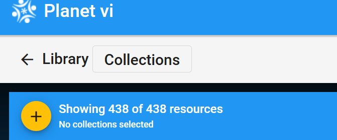
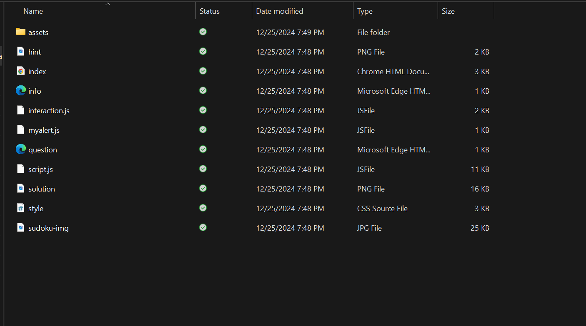
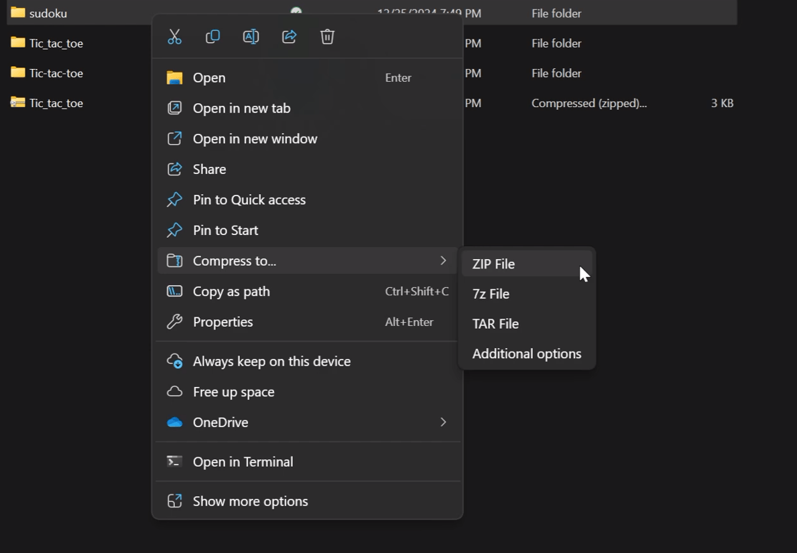
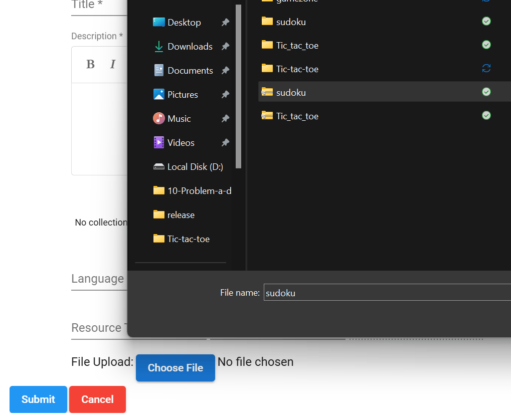
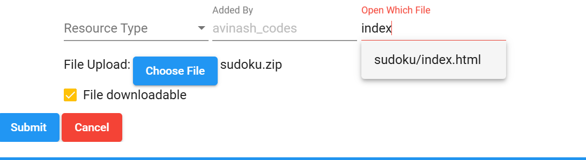
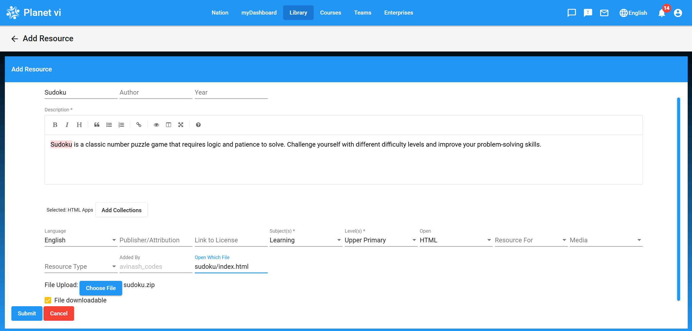
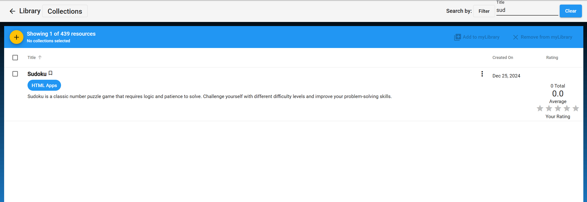
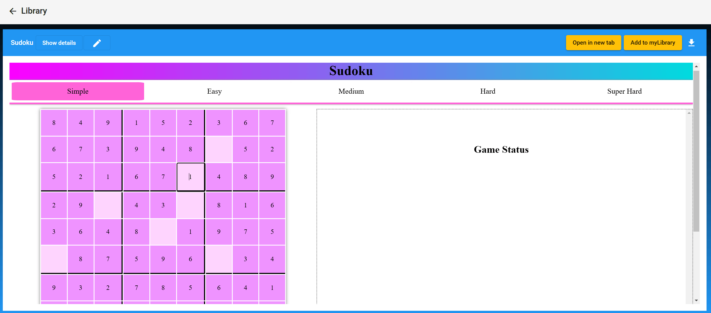

# Adding HTML Games to planet.vi

In this section, you will learn how to add HTML games to the planet `vi` nation. Follow the steps below carefully and refer to the provided screenshots for better clarity.

## Step 1: Visit planet vi

- Navigate to [https://planet.vi.ole.org/](https://planet.vi.ole.org/)

## Step 2: Sign In or Register

- If you already have a non-admin account, sign in.
- If you don’t have an account, click "Become a Member" to register.

## Step 3: Navigate to the Library

- Once signed in, go to the Library section.
- Click the "+" icon to add new resources. For this tutorial, you'll add HTML games.

## Step 4: Prepare Your HTML Game

- Research or create an HTML game. You can use GitHub or other online resources as references. Be creative!
- Test your game locally to ensure it works as expected.

## Step 5: Example: Sudoku Game

For guidance, here is an example of a simple Sudoku game. You can use a single `.html` file or include multiple files if needed.

## Step 6: Organize Your Files

- Put all your files in a single folder.
- Create a `.zip` file of the folder. Below is an example of how to create a `.zip` file on Windows:
  - Select all files.
  - Right-click and choose "Compress" or "Create Zip."

  

  

## Step 7: Upload Your Zip File

Click "Choose File" and upload your `.zip` file. For example, "sudoku.zip."

## Step 8: Fill in the Details

- Complete the required fields (e.g., name, description, tags).
- Add the game to the "HTML Apps" collection by clicking "Add Collections."

## Step 9: Specify the Open With File

If your zip file contains multiple files, specify the main `.html` file (e.g., `index.html`) in the "Open With" field.

## Step 10: Submit the Game

After filling in all the details, click "Submit."

## Step 11: Test Your Game

Search for your game in the Library and test it to ensure it works properly.

## Step 12: Success!

Congratulations! You have successfully added your first HTML game. Play and test it to ensure everything works.

