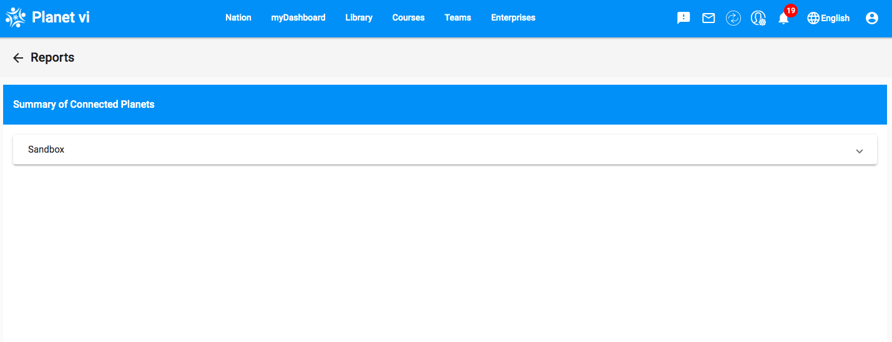

# Nation Planet (Step 7)

## Objectives

- Learn how to sync your Community with the Nation.
- Use the Nation interface to verify if your Community has successfully joined the Nation.
- Update your Community Planet to the latest version.

## Introduction

In [Step 2.2 - Planet Configurations](vi-planet-configurations.md), you registered your Community Planet with the "vi" nation. Now, you will learn how to keep your Community Planet in sync with the nation.

To achieve this, there should be regular communication between the nation and the communities. Although not required for remote communities in the field, this synchronization is crucial for "improving the software and testing the increasing forms of communication and feedback between the nation and the communities." This communication involves a syncing process from the community side, where you select the material to send to the nation.

Ensure Docker is running and visit [http://localhost:3300](http://localhost:3300) to access your Community Planet.

**NOTES:** Before you can sync with the nation after registering your community, you need to create an additional dummy user in your community:
1. Create a quick additional user under **Become a Member** on the login page. *(Hint: pick a simple password like `a`.)*
2. Log in to your admin account and ensure the new user is listed under **Members** on the Manager Settings page.

For any additional questions, please refer to the FAQ section (link in the Useful Links).


## Sync With the Nation

In [Step 4 - Planet Tutorial - Different Kinds of Updates to Your Community](vi-planetapps.md#Different_Kinds_of_Updates_to_Your_Community), we described three types of updates you might receive on the community side: **Upgrades**, **Resources/Courses**, and **Sync**. One crucial sync is between your community and the nation, which sends data about your community to the nation.

To start the sync process:

1. Click on the **Manager** icon, as shown in the image below.

  

2. Next, click on **Manage Sync**.

  

3. You will be taken to a page displaying all sync processes. Click the **Run Sync** button.

  

4. You will be prompted to enter the Administrator password. After entering the password, the sync process will begin.

By syncing, you send all community activities to the nation. The nation receives aggregated data, such as the number of resources opened, logins, members, resource ratings, technical feedback, and resource requests. This data is not specific to individual users but rather reflects overall usage and feedback.

## Check Sync Status

To verify that the sync was successful, log in to the nation side at [planet.vi.ole.org](http://planet.vi.ole.org) using the username `vi`. For password, send `-get_vi_nation_pwd` in the #vi-software Discord channel and you will receive a DM containing the password from YAGPDB bot.


Once logged in, click on the **Manager** icon.


Then, click on **Reports** to access reports from various communities within the nation.


Next, click on the **Sandbox** tab.



You will see a list of communities. Find and click on your community name to view its report.


You will now see a report of your community, which includes graphical and tabular statistics of the data you synced earlier.


## Update your community

Go to your community Planet's Manager Settings page. You should see an option to perform an Upgrade.
If you do not see the **Upgrade** button, please check your current **Nation version** and your current **Local version**. If both versions appear to be the same, this indicates your planet is already up-to-date. If you see any other message(s) below your version, please send a message on the Discord server Channel along with a screenshot of what you are seeing.


Click on the **Upgrade** button and you will be presented with the Upgrade page. Click on the **Start Upgrade** button.


You should then see a log of the current upgrade process along with a progress bar. Once the upgrade has completed, a message will appear informing you that the upgrade was successful.


NOTE: If you see an error message during the upgrade process please try again.

You will have to restart your community for the upgrade's changes to take effect.
Run the following commands on your terminal/command prompt to restart your virtual machine. Please make sure you are in the correct folder path where your planet exists.

```
vagrant halt prod
vagrant up prod
```

## Useful Links

[Helpful links and videos](vi-faq.md#Helpful_Links)

## Next Section _([Step 8](vi-create-issues-and-pull-requests.md))_ **→**


In the next section, you will create and resolve more issues with GitHub.

#### Return to [First Steps](vi-first-steps.md#Step_7_-_Nation_Planet)
