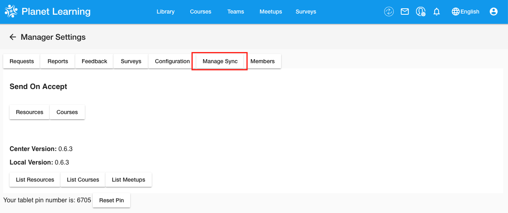

# Nation Planet

## Objectives

* Learn to sync your Community with the Nation
* Use the Nation interface to check whether your Community has successfully joined the Nation
* Update your Community Planet to the latest version

## Introduction

In [Step 1 - Planet Installation - Configuration](vi-configurations-vagrant.md), you registered your community Planet with the nation. Now, you will learn how to keep your community Planet in sync with the nation.

There should be constant communication between the nation and the communities. While it is not necessary for remote communities in the field, it is ideal for our goals of "improving the software and testing the increasing forms of communication and feedback between the nation and the communities". This communication takes the form of a syncing process from the community side, where you select material to send to the nation.

Make sure Vagrant is running and then click [here](http://localhost:3100) to access your Community Planet.
It is recommended that you use Firefox since Planet is only guaranteed to run properly on Firefox.

**NOTES**: After you register your community, but before you can sync with the nation, you need to create an additional dummy user in your community. Thusly, here is how to create a dummy user:
1. Create a quick additional user under "Become a Member" on the login page (HINT: When creating the dummy user, don't give it   a password that you actually use).
2. Then, log in to your admin account and double-check that you're listed under Members on the Manager Settings page.
3. Now that your community has a user, you can sync with the nation.
For any additional questions, please look at the FAQ section (link in the Useful Links).


## Sync With the Nation

In [Step 4](vi-planetapps.md#Different_Kinds_of_Updates_to_Your_Community), we listed 3 kinds of updates that you might receive on the community side: Updates, Publications, and Surveys. Another important type of update is the reverse: syncing with the nation. This sends data about your community to the nation.

You can click on the "Manager" icon as can be seen in the picture below.


Next, click on "Manage Sync".



Then, you will end up on a page showing all sync process. Click on the **Run Sync** button.


You will be prompted to provide an Administrator password. Once you confirm this password, the sync process will start.

You have now sent all activities from your community to the nation. To elaborate, the nation receives a number of data points: number of resources opened, number of logins, number of members, resource ratings, technical feedback, and resource requests. We don't get specific information on individual users, but rather data on usage and feedback as a whole.

## Check Sync Status

On the nation side ([planet.vi.ole.org](http://planet.vi.ole.org)), you can log in with the username `vi` and the password `iv` and check that the sync worked.


Click on "Manager" once again.


Then, click on "Reports" to access reports from various communities in the nation.


You should see a list of communities. Click on your community to view its report.


Finally, you will see a report of your community. It will have some graphical and some tabular statistics of your community data you synced earlier.


## Update your community

On your [local community](http://localhost:3100) login as Administrator. Then go to the Manager Page. You should see an option to perform an Upgrade.
If you do not see the **Upgrade** button, please check your current **Nation version** and your current **Local version**. If both versions appear to be the same, this indicates your planet is already up-to-date. If you see any other message(s) below your version, please send a message on the Gitter Chat Channel along with a screenshot of what you are seeing.


Click on the **Upgrade** button and you will be presented with the Upgrade page. Click on the **Start Upgrade** button.


You should then see a log of the current upgrade process along with a progress bar. Once the upgrade has completed, a message will appear informing you that the upgrade was successful.


NOTE: If you see an error message during the upgrade process please try again.

You will have to restart your community for the upgrade's changes to take effect.
Run the following commands on your terminal/command prompt to restart your virtual machine. Please make sure you are in the correct folder path where your planet exists.

```
vagrant halt prod
vagrant up prod
```

## Useful Links

[Helpful links and videos](vi-faq.md#Helpful_Links)

## Next Section _([Step 8](vi-first-steps.md#Step_8_-_Create_Issues_and_Pull_Requests))_ **→**

In the next section, you will create and resolve more issues with GitHub.

#### Return to [First Steps](vi-first-steps.md#Step_7_-_Nation_Planet)
