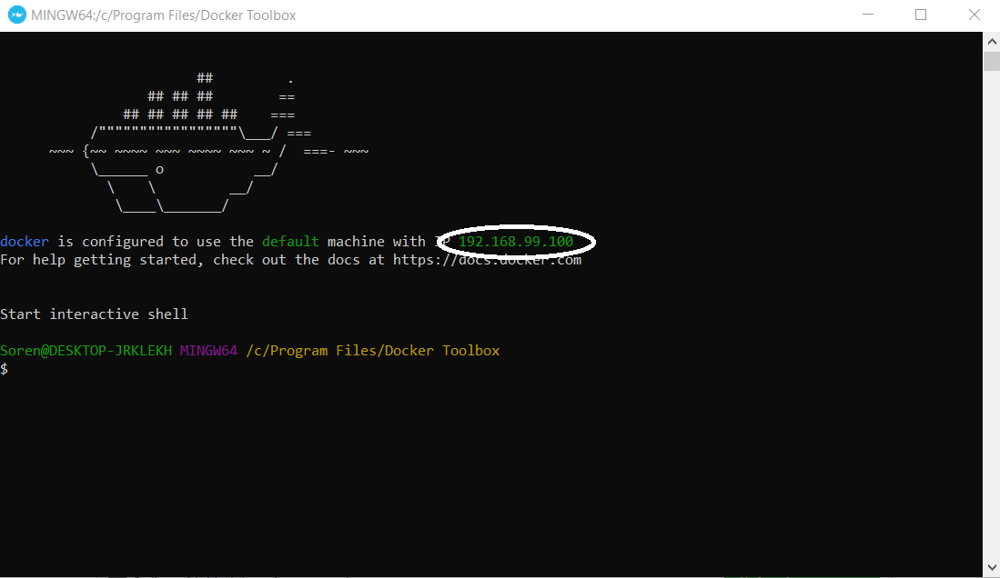
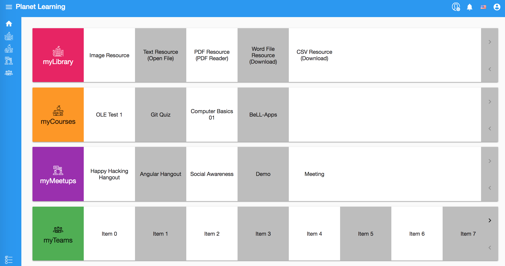

# Planet Installation and Configuration

We are currently rewriting BeLL, the project is called **[`planet`](https://github.com/open-learning-exchange/planet)**. The objective is to create a Progressive Web App using Angular & CouchDB with the BeLL Apps functionality.

Please follow the directions below to install Docker and your community `planet` to your machine. There are three parts in this section, you can use the side bar on the left to quickly navigate between them.

---

## Install Docker

In order to run `planet`, you will need Docker Community Edition installed.

### Windows

- For **64bit Windows 10 Pro, Enterprise and Education 1607 Anniversary Update, Build 14393 or later**, please use one of the following 2 methods to installs Docker for Windows:
  - Follow the official [Install Docker for Windows](https://docs.docker.com/docker-for-windows/install/) guide
  - [Chocolatey](https://chocolatey.org/) – the package manager for Windows was installed to your machine in the previous step. Please read [What to know before you install
](https://docs.docker.com/docker-for-windows/install/#what-to-know-before-you-install) and run `choco install docker-for-windows`
- If you do not have Windows version specified above, you will need to install [Docker Toolbox](https://docs.docker.com/toolbox/overview/). Please follow the official guide [Install Docker Toolbox on Windows](https://docs.docker.com/toolbox/toolbox_install_windows/).

### macOS

Please follow the official [Install Docker for Mac](https://docs.docker.com/docker-for-mac/install/) guide or the brief rundown below:

#### What to know before you install

- **System Requirements**: Docker for Mac launches only if all of these requirements are met.
  - 2010 or newer Mac machine
  - Run the following command in a terminal: `sysctl kern.hv_support` and look for result **kern.hv_support: 1**
  - macOS El Capitan 10.11 and newer macOS releases
  - At least 4GB of RAM
  - VirtualBox prior to version 4.3.30 must NOT be installed.
- If your system **does not** satisfy requirements above, you can install [Docker Toolbox](https://docs.docker.com/toolbox/overview/), which uses Oracle VirtualBox instead of HyperKit. Please follow the official guide [Install Docker Toolbox on macOS](https://docs.docker.com/toolbox/toolbox_install_mac/).

- What the install includes: The installation provides Docker Engine, Docker CLI client, Docker Compose, Docker Machine, and Kitematic.

#### Install and run Docker for Mac

- Download [Docker for Mac](https://store.docker.com/editions/community/docker-ce-desktop-mac) (sign-up for free Docker ID required.)
- Double-click Docker.dmg to open the installer, then drag Moby the whale to the Applications folder.
- Open Docker from the Applications folder/Launchpad/Spotlight to start Docker.
  - You will be prompted to authorize Docker with your system password after you launch it. Privileged access is needed to install networking components and links to the Docker apps.
  - The whale in the top status bar indicates that Docker is running, type `docker` in terminal to see if it works.
- You are up and running with Docker for Mac.

### Linux

Please find your distro at https://docs.docker.com/install/#server and follow the guide to install Docker CE.

Below is a brief rundown is for **Ubuntu 16.04** :

#### Prerequisites

- **OS requirements** 64-bit version of one of these Ubuntu versions:
  - Artful 17.10 (Docker CE 17.11 Edge and higher only)
  - Xenial 16.04 (LTS)
  - Trusty 14.04 (LTS)
- **Uninstall older versions of Docker** `sudo apt-get remove docker docker-engine docker.io`

#### Install Docker CE using the repository

##### Set Up the Repository

- Update the apt package index: `sudo apt-get update`
- Install packages to allow apt to use a repository over HTTPS
  ```
  sudo apt-get install \
    apt-transport-https \
    ca-certificates \
    curl \
    software-properties-common
  ```
- Add Docker’s official GPG key: `curl -fsSL https://download.docker.com/linux/ubuntu/gpg | sudo apt-key add -`
- Use the following command to set up the stable repository
  ```
  sudo add-apt-repository \
    "deb [arch=amd64] https://download.docker.com/linux/ubuntu \
    $(lsb_release -cs) \
    stable"
  ```

##### Install Docker CE

- Update the apt package index: `sudo apt-get update`
- Install the latest version of Docker CE: `sudo apt-get install docker-ce`
- Verify that Docker CE is installed correctly by running the hello-world image: `sudo docker run hello-world`

#### Install Docker Compose

Follow the official [Install Docker Compose](https://docs.docker.com/compose/install/#install-compose) guide or the brief rundown below:

- Note the latest release version number at https://github.com/docker/compose/releases/latest. e.g. `1.21.2`. You will need to replace `<latest-release-version-number>` with this in next command.
- Run this command to download the latest version of Docker Compose:
  ```
  curl -L https://github.com/docker/compose/releases/download/<latest-release-version-number>/docker-compose-`uname -s`-`uname -m` -o /usr/local/bin/docker-compose
  ```
- Apply executable permissions to the binary: `sudo chmod +x /usr/local/bin/docker-compose`
- Test the installation: `docker-compose --version`

---

## Planet Installation

1. Launch Docker on your machine

1. Go to your OLE project folder

1. Clone the `planet` repository: `git clone https://github.com/open-learning-exchange/planet.git`

1. Go to 'planet/docker' folder: `cd planet/docker`

1. Pull the latest `planet` and its db-init Docker image

  - `docker pull treehouses/planet:latest`
  - `docker pull treehouses/planet:db-init`

  - `docker tag treehouses/planet:latest treehouses/planet:local`
  - `docker tag treehouses/planet:db-init treehouses/planet:db-init-local` 

1. Run the following command to spawn your environment for the **first time**: `docker-compose -f planet.yml -p planet up -d --build`

1. See if the docker containers are running: `docker ps`. You'll see your running container similar to this

  ```
  CONTAINER ID        IMAGE                       COMMAND                  CREATED             STATUS                      PORTS                                        NAMES
  6ad5d3f2ba2b        treehouses/planet:latest    "/bin/sh -c 'sh ./do…"   38 seconds ago      Up 46 seconds               0.0.0.0:80->80/tcp                           planet_planet_1
  e78eb9287454        treehouses/planet:db-init   "/bin/sh -c 'bash ./…"   38 seconds ago      Exited (0) 34 seconds ago                                                planet_db-init_1
  3c2309e92dc6        treehouses/couchdb:2.1.1    "tini -- /docker-ent…"   39 seconds ago      Up 48 seconds               4369/tcp, 9100/tcp, 0.0.0.0:2200->5984/tcp   planet_couchdb_1
  ```

1. See log in action with `docker-compose -f planet.yml -p planet logs -f`, press 'CTRL+C' to exit logs view

---

## Planet Configuration

Go to your community `planet` at <http://127.0.0.1>.

 For Windows, if you are using docker toolbox then you should use the IP Address given in the docker toolbox instead of 127.0.0.1. Please look for IP Address as seen in image below.


 
You will be asked to:

- Create an admin account
- Fill out configuration
  - To create your `planet` community and connect to the Virtual Intern Nation:
    - Select `Community` from `Select Nation/Community`drop-down
    - Select `vi` from `Nation(s)` drop-down
    - Use your GitHub username as `Name` so we can locate you on Virtual Intern nation. (`Name` must be unique on the nation side, if you have configured `planet` using your GitHub username before, please add a letter or digits to the end of your original username.)
    - `Code` is not editable and it will be automatically filled
- Fill out contact details
- Click `Submit` and let us know in the Gitter chat <!-- so we can accept your community registration on VI Nation -->


After logging in, please explore around and post a screenshot of your `planet` to the Gitter chat.



When you're done, you can stop `planet`: `docker-compose -f planet.yml -p planet stop`
When you want to have `planet` up and running again: `docker-compose -f planet.yml -p planet start`

## Useful Links

[FAQ – Helpful links](vi-faq.md#Helpful_Links)

## Next Section **→**

Now you have `planet` installed, head over to [Docker Tutorial](vi-docker-tutorial.md) to learn about the basics of interacting with Docker and Docker Compose through the command-line interface.

#### Return to [First Steps](vi-first-steps.md#Step_2_-_Planet_and_Docker)
