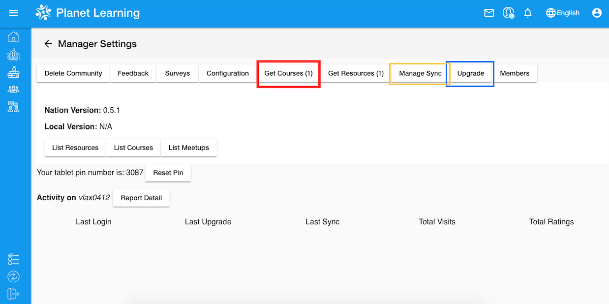
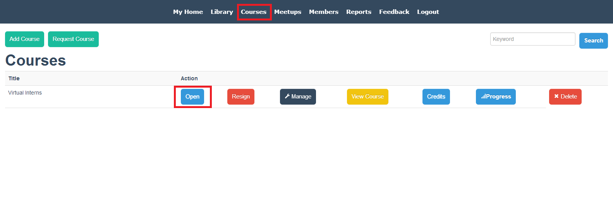

# Planet Tutorial

## Objectives

* Understand how Planet interface is structured
* Understand basic functions of community Planet
* Add resources to your Community in order to get accustomed to the Planet interface

## Preparation
Please go to http://localhost:3100 or run `vagrant global-status` in the command line to see if your community Planet is currently running. If not, please `cd` into `planet` directory in your local machine and run `vagrant up prod`.

Do not forget to send the screenshot of your Planet community configurations ([from the earlier step when you registered your configurations](vi-configurations-vagrant.md)) to our chat. In case you forgot to take the screenshot of your configurations, login to Planet, click on manager settings (top bar person with gear icon), click on the configuration button, take a screenshot of the page, and send it to the Gitter chat.

## Watch Videos

Watch the videos below to learn the basic functions of your Planet. These videos were created a few years ago, on old system BeLL but they should do a decent job of introducing you to the Planet.

[My Dashboard](movies/vi-mydashboard.mp4)
[Library](movies/vi-library.mp4)
[Feedback](movies/vi-feedback.mp4)
[Generating Activity Reports](movies/vi-generatingactivityreports.mp4)

We suggest you to play around a bit, try to explore and feel comfortable with Planet.

## Upload Resources

In this section, we will practice uploading resources to the Planet. Although there are several kinds of resources, the majority of them are PDFs, mp3s, and mp4s.

Here are three type of resources that you can download to your computer and then upload to your Planet. Right-click on each one of these links and save them to your computer.

[PDF - "Feelings"](pdf/vi-feelings.pdf)
[mp3 song - "Opposite Song"](music/vi-oppositesong.mp3)
[mp4 video - "Burka Avenger"](movies/vi-burkaavenger.mp4)

Next, go to [your community Planet](http://localhost:3100). Select `Library` from the dashboard, then select `+` icon. You will see:

Fill out the information:

- As we are just doing this as a practice, accuracy of information/source of content is not very important.
- Make sure to have something in all of the drop-down menus and text boxes.

Next, click on `Submit`. You have now uploaded the resource. You should be able to find the resource in Library, make sure that you can open it. Repeat the same process for all three resources.

## Different Kinds of Updates to Your Community

There are three important kinds of updates that you may receive on the community side: updates,  resources/courses and sync. If you do not see the buttons highlighted in the picture below on your Manager page, post a message to the Gitter Chat channel to get help.

As you can see from the image below, there is an update ready to be downloaded. Usually, next to the update, you should also see publication(s) (we send to you from the nation) ready to be downloaded.

- First, click the "Upgrade" button on Manager page and it take you to upgrade page. An update refers to a software update which improves the Planet. If you do not see "Upgrade" button then simply carry on.
- Next, click on "Get Courses" or "Get Resources", under the Manager page. It will fetch Courses or Resources provided to community by nation.
- Last, repeat the process of sending an activities sync to the nation.

**NOTE**: If there is an "internet connection" error when you click the "Upgrade" button, please repeat the step.

## Take the Course

We created a course for aspiring virtual interns so that we could test the software used to build courses and find bugs/things to improve. It is your job to take the course and find out what needs to be fixed/improved from the student standpoint.

Take the course, and the last question will ask you to specify any problems or improvements/suggestions that you have. Remember, people taking these courses in remote areas of the world will probably run into the same problems if you do not raise them now and let the team know. This is a very important task, and your help is much appreciated.

**STEPS:**

1. Click on `Courses` on the top navigation
2. Find the course "Virtual Interns", select checkbox next to course and then click on `Join`
3. Click on Course to `Open`
4. Carefully finish all steps of the course

  

5. To verify that your course answers were submitted, click on `Home`, then on `Submissions`

  
  

6. When you provide feedback, try to be as specific as possible, and include screenshots when necessary

If the course "Virtual Interns" is not there, check `Manage Sync` of manager settings page to see if your synchronization are completed. Otherwise please message us and "@" an admin in the Gitter chat so we can send you the course manually.

## Useful Links

[Helpful links and videos](vi-faq.md#Helpful_Links)

#### Return to [First Steps](vi-first-steps.md#Step_4_-_Planet_Tutorial)
