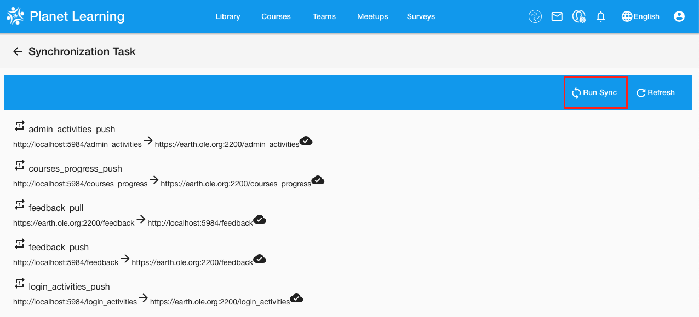

# Planet Tutorial (Step 4.1)

## Objectives

- Understand how Planet interface is structured
- Understand basic functions of community Planet
- Add resources to your Community in order to get accustomed to the Planet interface

## Preparation

Please go to http://localhost:3300 or run `docker container ls` in your Linux/macOS terminal or Windows WSL Debian app / Git Bash to see if your community Planet is currently running. If not, please `cd` into `planet` directory created in step 1 in your local machine and run `docker compose -f planet.yml -p planet start`.

Don’t forget to send a screenshot of your Planet community configurations from [the earlier step](vi-planet-configurations.md). If you forgot to take the screenshot, log in to Planet, click on "Manager Settings" (the person with a gear icon on the top bar), select "Configuration," take a screenshot of the page, and send it to the Discord server.

## Watch Videos

Watch the following videos to learn the basic functions of your Planet. While they were created some years ago using the old BeLL system, they still provide a good introduction:

- [My Dashboard](movies/vi-mydashboard.mp4)
- [Library](movies/vi-library.mp4)
- [Feedback](movies/vi-feedback.mp4)
- [Generating Activity Reports](movies/vi-generatingactivityreports.mp4)

We suggest you play around a bit, try to explore and feel comfortable with Planet.

## Upload Resources

In this section, we'll practice uploading resources to the Planet. Most resources are PDFs, MP3s, and MP4s.

Download the following resources to your computer by right-clicking on each link and selecting "Save as":

- [PDF - "Feelings"](pdf/vi-feelings.pdf)
- [MP3 song - "Opposite Song"](music/vi-oppositesong.mp3)
- [MP4 video - "Burka Avenger"](movies/vi-burkaavenger.mp4)

To upload these resources to your Planet:

1. Go to [your community Planet](http://localhost:3300) and select `Library` from the dashboard.
2. Click the yellow `+` icon to add a new resource.
3. Fill in all the required text boxes and drop-down menus marked with "\*". (For practice, the accuracy of the information isn't important.)
4. Upload one of the downloaded files: PDF, MP3, or MP4.
5. Click "Submit" to upload the resource.
6. Verify that the resource appears in the `Library` and can be opened.
7. Repeat these steps until all three files have been uploaded.

## Different Kinds of Updates to Your Community

There are three main types of updates you may receive for your community:

- **Upgrades**: Software updates that enhance the Planet LMS.
- **Resources/Courses**: Selected resources and courses are received automatically from the "nation" after your community registration is accepted. The nation may also send additional resources or courses.
- **Sync**: Synchronizes your community with the nation for updates on meetups, courses, exams, resources, and more. The sync could be bi-directional, depending on the configuration.

Go to your Manager page and look for the "Upgrade", "Fetch Items", and "Manage Sync" buttons highlighted in the pictures below.

You might not see the "Upgrade" or "Fetch Items" button if there's no update or the nation has not manually sent anything to your community. However, **if "Manage Sync" button is missing for you**, please post a message in our Discord server's #vi-software channel to confirm that we have accepted your community connection with the vi nation.

1. **Fetch Items**: If the `Fetch Items` button is visible, click on it, select all, and use the "Get Courses/Resources" button to download the available courses.

   

2. **Sync**: Finally, sync your activities with the nation by clicking the `Manage Sync` button on the Manager page. On the sync processes page, click `Run Sync`, and enter your admin password when prompted to start the sync process.

   

**NOTE:**
- If you encounter an "internet connection" error when clicking the "Upgrade" button, please repeat the step.
- If new updates are not reflected, use `Command+Shift+R` (Mac) or `Control+Shift+R` (Windows) to clear the cache and refresh the page.

## Take the Course

We have created a course for aspiring virtual interns to test out the courses feature in Planet and identify any bugs or areas for improvement. Your task is to take this course in Planet and note any issues or suggestions for enhancement from a student’s perspective.

As you go through the course, the last question will ask for your feedback on any problems you encountered or suggestions you have. Remember, individuals in remote areas who take these courses might face similar issues, so reporting them now will help the team make necessary improvements. Your assistance with this task is greatly appreciated.

**STEPS:**

1. Click on **Courses** in the top navigation menu.
2. Search for the course "GitHub Issues and Pull Requests," select the checkbox next to the course title, and click on **Join**.
3. Click on the course to open it and start with **View Steps**.
4. Carefully complete each step of the course, and be sure to take the quiz at the end of each step if one is available.
5. When rating a course, aim to be as specific as possible.

  
  

If the course "GitHub Issues and Pull Requests" is not listed, check the **Manage Sync** section on the Manager Settings page to see if your synchronization has been completed. If not, please message us on the Discord server so we can manually send you the course.

## Useful Links

[Helpful links and videos](vi-faq.md#Helpful_Links)

## Next Section _([Step 4.2](vi-myplanet.md))_ **→**

In the next step, you can learn about the Android version of the Planet application, called myPlanet, if you have an Android device.

#### Return to [First Steps](vi-first-steps.md#Step_4_-_Planet_and_myPlanet_Tutorial)
